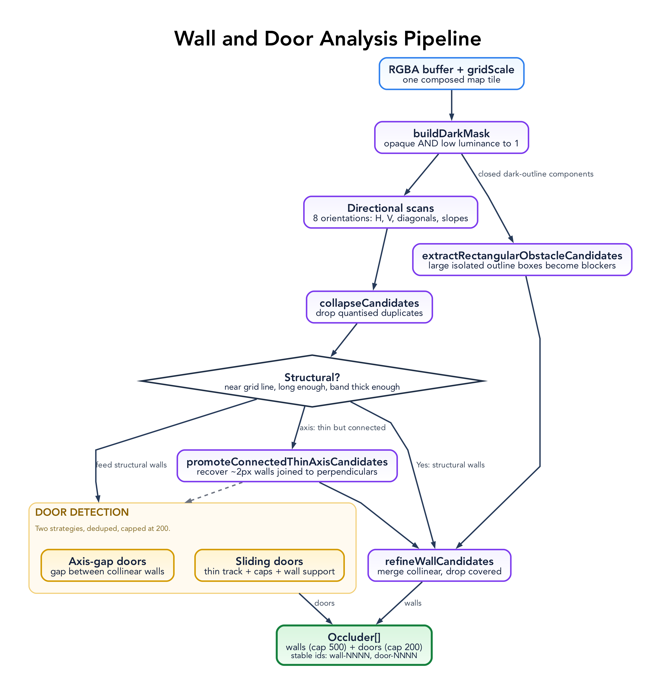

# Line of Sight Architecture

Line of Sight is a browser-first tool for extracting and reviewing visibility
metadata from geomorphic tactical maps. It is built from three layers with a
strict, one-directional dependency rule.


This document maps *what exists and where*. [`PATTERNS.md`](PATTERNS.md) explains
*why each piece has its shape*; diagram sources live in
[`diagrams/`](diagrams/README.md). All coordinates throughout are board pixels
with the origin at the top-left.

## Layers

### Deterministic core — `web/src/los-core.ts`

Pure TypeScript geometry and image analysis: no DOM, no Cloudflare, no Preact.
Given a raw RGBA buffer it produces candidate walls and doors; given occluders
and a viewpoint it answers line-of-sight queries and builds a visibility polygon.
Being side-effect free and deterministic, it is unit-tested in isolation
(`web/src/los-core.test.ts`). Detailed in
[The deterministic core](#the-deterministic-core).

### Browser UI — `web/src/main.tsx`

A Preact app using `@preact/signals` for state, rendering the board to a 2D
`<canvas>`. It owns the whole interactive surface and calls into the core for all
geometry. `web/src/gpu.ts` is a small runtime WebGPU capability probe surfaced as
a status string; the app renders with the 2D canvas regardless. Detailed in
[Browser UI](#browser-ui).

### Cloudflare Worker — `src/worker.ts`

A thin shell that answers `GET /healthz` and otherwise delegates to the static
`ASSETS` binding (the Vite build in `dist/client`). `wrangler.toml` wires it up:
`main = "src/worker.ts"`, the `dist/client` assets directory with
`not_found_handling = "single-page-application"` (unknown paths fall back to the
SPA shell), and the `los.tre.systems` custom-domain route. It contains no
detection or visibility logic. Build and deploy with `npm run deploy`; commands
and cadence are in [`AGENTS.md`](../AGENTS.md).

## Session data flow

```
Local map images ──drag/drop or picker──▶ tiles ──arrange──▶ placements (board grid)
                                                                  │
                                              analyze (per placement, via core)
                                                                  ▼
        manual walls/doors  ◀──hand-correct──  occluders  ──carveDoorGaps──▶ occluders
                                                                  │
   place counter tokens ──pick a point-of-view token──▶ visibilityPolygon (core)
                                                                  │
                                          render: map + walls + fog + tokens
                                                                  ▼
                                       export ──▶ LOS sidecar JSON (clipboard/download)
```

1. **Load** one or more local images. Each becomes a `Tile`; `arrangeTiles` lays
   them into a `columns`-wide grid of `Placement`s and sizes the board.
2. **Analyze** rasterises each placement to an offscreen canvas, runs
   `analyzeImageRgba`, and maps detected occluders back into board space
   (`transformOccluder`). Existing `manual-*` occluders are preserved.
3. **Correct** walls and doors by hand; door gaps are carved out of overlapping
   walls (`carveDoorGaps`) so a closed door blocks and an open one lets sight
   through.
4. **Review** by placing counter tokens, electing one as the point-of-view, and
   toggling doors. The viewpoint's visibility polygon drives the live fog; seen
   areas accumulate on a separate "explored" canvas.
5. **Export** the reviewed occluders (plus board size, grid scale, and tokens) as
   [sidecar JSON](#sidecar-format).

## The deterministic core

`web/src/los-core.ts` has two responsibilities: **detect** candidate occluders
from raster map art, and **answer visibility queries** against a set of
occluders. It must stay free of DOM, Cloudflare, and Preact concerns (see Coding
Rules in [`AGENTS.md`](../AGENTS.md)).

### Types

```ts
type Point = { x: number; y: number }

type WallOccluder = { type: 'wall'; id: string; x1; y1; x2; y2 }
type DoorOccluder = { type: 'door'; id: string; x1; y1; x2; y2; open: boolean }
type Occluder    = WallOccluder | DoorOccluder
```

`analyzeImageRgba` returns a flat `Occluder[]` — the detected walls followed by
the detected doors. The board's width, height, and grid scale are inputs the
caller already holds, so they are not echoed back in the result.

A `DoorStateLookup` (`Record<string, boolean | {open: boolean} | undefined>`)
lets callers override door open/closed state without mutating the occluders;
both the boolean and `{open}` shapes are accepted, falling back to the door's own
`open` field.

### Detection pipeline — `analyzeImageRgba`

Input is a raw RGBA buffer plus a `gridScale` hint. The buffer length must equal
`width * height * 4` and dimensions must be positive, or it throws.



1. **Dark mask** (`buildDarkMask`). Each pixel is marked `1` when its alpha is
   above 32 and its Rec. 709 luminance (`0.2126r + 0.7152g + 0.0722b`) is below
   58 — i.e. opaque and dark, which is how walls are drawn on these maps.
2. **Derived thresholds.** `effectiveGrid` defaults to 50 if the hint is invalid.
   `minRun = max(grid * 0.45, 18)` is the shortest accepted run; `snap = max(grid / 4, 4)`
   quantises endpoints onto a sub-grid.
3. **Directional scans.** The mask is scanned for dark runs along eight
   orientations: horizontal, vertical, the two 45° diagonals, and four
   shallow/steep slopes (1:2 and 2:1 in each diagonal direction). Diagonal scans
   use `isDarkNear` (a 3×3 neighbourhood test) for tolerance to anti-aliasing.
4. **Collapse** (`collapseCandidates`) removes duplicate runs that quantise to
   the same key.
5. **Structural filter** (`isStructuralWallCandidate`). Axis runs must sit near a
   grid line (`nearGridLine`), clear a minimum length, and have a dark band at
   least 3px thick (`candidateBandThickness`). Diagonals use a longer minimum
   length and a perpendicular band test (`diagonalBandThickness`).
6. **Thin-wall promotion** (`promoteConnectedThinAxisCandidates`). Axis runs that
   are only ~2px thick are promoted to walls when they are long enough or
   connect to perpendicular walls at their endpoints
   (`axisEndpointSupportCount`) — this recovers thin interior walls that the
   strict band test would drop.
7. **Rectangular obstacle recovery** (`extractRectangularObstacleCandidates`).
   Closed dark-outline rectangles, such as large cargo containers, are converted
   into four blocking wall segments when all four sides have strong dark
   coverage and the component is not part of the map edge.
8. **Door detection** (`detectDoorCandidates`), see below.
9. **Refine** (`refineWallCandidates`). Collinear axis walls on the same grid
   line are merged across small gaps (`mergeAxisCandidates`), then segments
   mostly covered by a longer one are dropped (`removeRedundantCandidates`).
10. **Emit.** Walls are sorted longest-first, capped at **500**, clamped to the
   board, and assigned stable ids `wall-0001`, `wall-0002`, …. Doors are emitted
   `closed` (`open: false`) with ids `door-0001`, ….

#### Door detection

Two complementary strategies, deduped and capped at **200**:

- **Axis-gap doors** (`detectAxisGapDoorCandidates`). A gap between two
  collinear wall runs on the same grid line, within `[~0.3·grid, ~1.15·grid]`,
  is a door. Larger gaps up to `~1.75·grid` are accepted only if a faint door
  marker is found in the gap (`gapContainsDoorMarker`) — sparse dark pixels that
  read as a drawn door rather than an open corridor.
- **Sliding doors** (`detectSlidingDoorCandidates`). Pairs of short parallel
  dark runs that form a thin track, with dark end-caps, a clear interior, and a
  collinear wall on the same line (`hasCollinearWallSupport`), are detected as
  sliding doors.

### Visibility queries

**`hasLineOfSight(from, to, occluders, doorStates)`** returns `true` when the
segment `from→to` crosses no **blocking** occluder. An occluder blocks when it is
a wall, or a door that is not open (`isBlocking` / `isOpenDoor`). Uses the
standard orientation-based segment-intersection test (`segmentsIntersect`).

**`visibilityPolygon(x, y, width, height, radius, occluders, doorStates)`**
builds the polygon visible from a viewpoint:

1. Collect blocking occluder segments plus the four board-edge segments
   (`boardSegments`).
2. Cast rays at 128 evenly-spaced base angles, plus three rays per segment
   endpoint (the angle and a tiny ± offset) so corners are captured cleanly.
3. For each angle, `castRay` keeps the nearest intersection
   (`raySegmentIntersection`) within `radius` (default: the board diagonal).
4. Sort hits by angle and `dedupePolygon` collinear/coincident points.

The viewpoint is clamped into the board. Non-positive or non-finite board
dimensions throw.

### Invariants worth preserving

- **Walls and closed doors block; open doors do not.** Encoded in `isBlocking`
  and relied on across the UI.
- **Determinism.** Same pixels + same `gridScale` ⇒ same occluders. No
  randomness, no time, no I/O.
- **Stable ids.** `wall-NNNN` / `door-NNNN` ids are zero-padded and
  position-ordered; hand-authored occluders use a `manual-` id prefix and are
  preserved across re-analysis.
- **Caps.** ≤500 walls and ≤200 doors per analysis. If a map legitimately needs
  more, that limit is the first thing to revisit.

## Browser UI

`web/src/main.tsx` renders the board to a 2D `<canvas>` and holds all state in
module-level signals that are **in-memory only** — a reload starts fresh, so the
[sidecar export](#sidecar-format) is the thing to keep. The two patterns behind
it are [signals and rendering](PATTERNS.md#signals-and-rendering) and
[snapshot undo/redo](PATTERNS.md#snapshot-undoredo).

### Layout

A full-bleed canvas with a collapsible **control drawer**. The drawer has four
tabs (`activeDrawerTab`): **Tools**, **Counters**, **Maps**, **State**. The
visual language follows the TRE direction in [`AGENTS.md`](../AGENTS.md): black
background, terminal-green accent (`#39ff14`), JetBrains Mono labels.

### Tools

The active tool (`tool` signal) decides how canvas pointer input is interpreted:

| Tool     | Purpose |
|----------|---------|
| `viewer` | Pan/inspect; select and drag the point-of-view, no editing. |
| `wall`   | Draw new wall occluders (stored with a `manual-` id prefix). |
| `door`   | Draw new door occluders. |
| `erase`  | Remove the occluder nearest the pointer. |
| `token`  | Place counter tokens of the active kind/group. |

Newly drawn walls and doors get `manual-` ids so re-running **Analyze** preserves
them while replacing the auto-generated ones.

### Maps tab

- **Load** local map images via the picker or by dragging files onto the window
  (drag state is tracked so the drop zone can highlight).
- **Columns** (`columnsValue`, default 2) controls how `arrangeTiles` lays tiles
  into a grid; the board is sized to fit.
- **Grid** (`gridValue`, default 50) is the pixel grid scale passed to analysis
  and used for snapping and door carving.
- **Analyze** rasterises each placement and runs the core detector, mapping
  results back into board space and carving door gaps out of overlapping walls.

### Counters tab

Twelve counter **kinds** (officer, marine, scout, engineer, medic, scientist,
trader, security, reptilian, amphibian, insectoid, psion), each with a WebP
portrait served from `web/public/token-portraits/`. Counters are grouped **A–H**;
within a group, members are auto-labelled (e.g. `A1`, `A2`, …). Pick the active
kind and group, then place tokens with the `token` tool. Any token can be elected
the **point of view** (`povTokenId`); its `visibilityPolygon` drives the live fog
and the optional sight-range ring.

### State tab

- **Sight** (`sightValue`, default 700) is the POV visibility radius in board
  pixels.
- **Show walls** (`showWalls`) overlays detected/edited occluders for review.
- **Hide unseen** (`hideUnseen`) toggles fog over never-explored areas.
- **Doors** can be toggled open/closed (`doorStates`); open doors stop blocking
  sight immediately.
- **Export** writes the [sidecar JSON](#sidecar-format).
- **Undo / Redo** walk the editor history.

### Fog and "explored" tracking


Two offscreen canvases back the fog:

- `exploredCanvas` accumulates every area the POV has ever seen. `markExplored`
  fills the current visibility polygon onto it, so previously-seen regions stay
  revealed even after the POV moves.
- `fogCanvas` is scratch space for compositing the current frame: areas outside
  the current visible polygon are dimmed, and never-explored areas (with **Hide
  unseen** on) are fully obscured.

### Editing occluders and tokens

- In `wall`/`door` tools, drag to draw; existing occluders can be grabbed by an
  endpoint (`start`/`end`) or body (`EditDrag`) and moved. A selected occluder
  can be converted between wall and door (`convertSelectedOccluder`).
- Points snap to the sub-grid while editing (`snapPoint`).
- A selected occluder or token can be deleted with the keyboard (below).
- Door gaps are re-carved (`carveDoorGaps`) so a closed door blocks the run it
  sits in and an open door clears it.

### Keyboard shortcuts

Active when focus is on the board (not an input field — `targetAcceptsMapShortcuts`):

| Keys | Action |
|------|--------|
| `Cmd/Ctrl + Z` | Undo |
| `Cmd/Ctrl + Shift + Z` or `Cmd/Ctrl + Y` | Redo |
| `Escape` | Clear selection/hover and cancel in-progress drags |
| `Delete` / `Backspace` | Remove the selected token, otherwise the selected occluder |

### Zoom and pan

Mouse-wheel zoom (`handleWheel`) is clamped to `[0.35, 4]` and centres on the
pointer. Stroke widths are divided by zoom (`screenPixels`) so overlays stay a
constant on-screen size.

## Sidecar format

The sidecar is the durable output of a review session — reviewed visibility
metadata for a composed board, ready to hand to another virtual tabletop. It is
produced by `exportSidecar`, which copies it to the clipboard or, if that is
unavailable, downloads `line-of-sight-sidecar.json`.

### Shape

```jsonc
{
  "assetRef": "composed-board",   // identifier for the composed board
  "width": 2000,                  // board width in pixels
  "height": 1000,                 // board height in pixels
  "gridScale": 50,                // grid size in pixels used for analysis/snapping
  "occluders": [ /* see below */ ],
  "tokens":    [ /* see below */ ]
}
```

[`AGENTS.md`](../AGENTS.md) names the core contract fields as
`{ assetRef, width, height, gridScale, occluders }` — preserve those. The current
exporter additionally serialises `tokens` so a session's counter layout
round-trips; keep that in mind when changing the shape.

### Occluders

Each occluder is a line segment with endpoints `(x1,y1)–(x2,y2)` and a stable id.

```jsonc
// wall
{ "type": "wall", "id": "wall-0001", "x1": 100, "y1": 50, "x2": 100, "y2": 300 }

// door — exported with its effective open/closed state
{ "type": "door", "id": "door-0001", "x1": 250, "y1": 50, "x2": 300, "y2": 50, "open": false }
```

- Auto-generated ids are zero-padded and ordered: `wall-0001…`, `door-0001…`.
- Hand-authored occluders use `manual-wall-<hex>` / `manual-door-<hex>` ids; the
  `manual-` prefix is how the app preserves them across re-analysis.
- **Walls and closed doors block line of sight; open doors do not.** Each door's
  exported `open` flag reflects its current toggled state (`doorStates`), not just
  the value from detection.

### Tokens

A token is a board-pixel point plus its counter identity.

```jsonc
{
  "id": "token-a1b2c3d4",    // "token-" + 8 hex chars
  "kind": "officer",         // one of the 12 counter kinds
  "group": "A",              // counter group A–H
  "member": 1,               // member index within the group
  "label": "A1",             // display label: group + member
  "x": 420, "y": 360         // board-pixel position
}
```

`kind` is one of: `officer`, `marine`, `scout`, `engineer`, `medic`, `scientist`,
`trader`, `security`, `reptilian`, `amphibian`, `insectoid`, `psion`. Export is
one-way — the app does not currently re-import sidecars.

## Build and patterns

- **Build** — Vite builds `web/` into `dist/client` (`root: 'web'`). TypeScript
  is strict ESM with `jsxImportSource: "preact"`. Runtime dependencies are kept
  minimal: `preact` and `@preact/signals`.
- **Patterns** — the design patterns that hold this together (layered separation,
  deterministic core, signals + single render effect, snapshot undo/redo, and
  candidate → review → export) are written up in [`PATTERNS.md`](PATTERNS.md).
