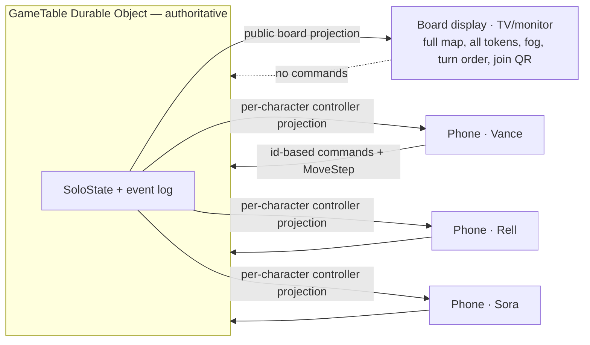

# Companion play: phones as controllers, board on the big screen

A play mode where the **map lives on a shared screen** (a TV, a monitor, a
projector) and **each player drives their own character from their phone**. The
phone is a gamepad plus a private character sheet — a movement control, a list of
the nearest opponents, pick-up/drop and door actions, and a heads-up status
strip — never a copy of the map. It is the "companion controller / second
screen" pattern (think a console companion app, or Jackbox) applied to a
turn-based tactical fight.

This is a design and build plan, not yet built. It targets the solo combat
engine (`web/src/solo/`) promoted to run inside the multiplayer Durable Object.

## Why this fits line-of-sight

Three properties already hold, which is what makes the mode cheap to reach:

1. **Almost every action is already identified by an id, not a map coordinate.**
   The solo `Action` union (`web/src/solo/model.ts`) is `Attack(targetId)`,
   `PickUp(groundItemId)`, `Search(containerId)`, `ToggleDoor(doorId)`,
   `Drop(stackIndex)`, `Reload`, `Aim`, `SetStance(stance)`, `EndTurn`. Each is a
   button or a list row with no map. Only `Move` carries a coordinate.
2. **Per-player line of sight is already the security boundary.** The table
   Durable Object projects a *different* view per viewer (`projectFor` /
   `visibleTokensFor` in `core/rules.ts`), so the "nearest opponents" list can be
   computed from only what that character can legitimately see.
3. **Movement is already cell-based.** `applyMove` (`web/src/solo/reducer.ts`)
   snaps an incoming point to a grid cell and lands on the cell centre, so a
   directional control maps straight onto it without the phone owning a canvas.

## Topology

One authoritative room (the `GameTable` Durable Object) stays the only writer and
fans out two kinds of viewer over the same event stream:

- **Board display (public):** a read-only "board" viewer — the whole deck, all
  tokens, fog as the dramatic shared picture, the turn order, and a persistent
  join QR. Issues no commands. It is the existing host/GM board, reframed as a
  table display.
- **Phone controller (private, one per character):** receives a per-character,
  fog-gated **controller projection** — whose turn it is, my HP/ammo/stance/
  budget, my nearest-opponents list, my in-reach items, my visible doors — and
  posts id-based commands plus one movement command. The room validates every
  command against *that character's own projection* before folding it.

## The phone controller

Fixed, never-moving two-thumb layout so it works by feel while the player watches
the big screen.

- **Targeting (list):** nearest *visible* opponents, each row showing range band,
  in-range flag, and hit chance (from `predictAttack`). Tap a row to select (a
  reticle echoes on the TV); the bottom-right **ACTION** button confirms the
  attack. Aim and Reload sit alongside; empty `loadedRounds` forces Reload.
- **Items (lists):** "In reach" (loot, containers, crates within reach,
  pre-filtered to legal PickUp / Search / PushProp / UseMedkit) and "Carrying"
  (Drop). Visible doors list the same way (ToggleDoor by id).
- **Status strip (always on):** whose turn, movement budget, the significant
  action, HP (STR/DEX/END), ammo, stance. EndTurn is a dedicated button kept
  away from the thumbs.
- **Haptics as a feedback channel:** the phone has no map, so feel carries
  meaning — a tick per step, distinct buzzes for blocked-by-wall vs edge-of-sight
  vs out-of-budget, a confirm tap, a kill buzz.

### Movement is the one part that is not a button

A naive 8-way d-pad fails the heads-up goal: a full turn is up to twelve cells,
and if the only feedback (did I reach cover? am I in range now?) is on the TV,
the player's eyes are pulled off the phone during the most spatial act in the
game. The fix is to make movement use the same grammar as everything else —
**move toward a named thing**:

- **Move-to-target (primary):** the lists already name every meaningful
  destination — a foe, a door, an item, a cover crate. "Move toward Sora" / "Move
  to that door" issues a command that the **server A\*-paths one cell per tick**,
  auto-stopping at the movement budget or a line-of-sight edge. Most real moves
  become a single tap with the same confirm grammar as Attack, and stay map-free
  because the target is a name, not a coordinate.
- **D-pad (fine adjust):** an 8-way step for nudging, showing **live
  per-direction legality** — each arrow greys out for wall / fog / out-of-budget
  using the same gates `applyMove` enforces, gated by the character's own line of
  sight — so a blocked step is visible *before* tapping, not explained by a buzz
  afterward.
- **Honest budget:** movement cost is Euclidean (a diagonal costs ~1.4× an
  orthogonal step, crouched doubles it), so the budget shows as metres remaining
  (or movement charges diagonals as whole cells) rather than misleading pips.

An optional **radar of nearest blips** ships from the start as the only purely
spatial cue the phone carries; a full phone minimap is deliberately avoided so
the map stays on the shared screen.

## Security model

The controller projection is a security boundary, exactly like `projectFor`. Get
this wrong and a phone becomes an aimbot that sees through walls.

- **Every list is built from that one character's line of sight** (`canSeePoint`),
  the per-entity analogue of `visibleTokensFor`. The solo engine's existing
  squad-wide vision helpers (`visibleToSquad`, `nearestEnemyOf`,
  `trackCombatants`) are single-player conveniences and must **not** be reused in
  the projection — they leak any foe a teammate can see.
- **Hidden foes are absent, not greyed.** `predictAttack` runs only over the
  visible set; an unseen enemy produces no row, no range band, no bearing.
- **`MoveStep` returns a uniform "blocked"** for any cell the character cannot see
  into, so hold-to-repeat cannot probe for invisible occupants one cell at a time.
- **Roles are server-assigned.** The omniscient board role is granted at host
  time; the phone claim path can only bind to a player character, never request
  the board role.

## What exists versus what is new

| Piece | Already in line-of-sight | New work |
| --- | --- | --- |
| Authoritative, event-sourced room | `GameTable` decide/fold/projectFor/replay | reuse |
| Per-viewer fog projection | `projectFor`, `visibleTokensFor` | a "board" role + a per-character controller projection |
| Id-based actions | the solo `Action` union | promote the reducer to run server-side |
| Movement | cell-based `applyMove` | a `MoveStep` direction command + a move-to-target (A\*) command |
| Opponent / item lists | `predictAttack`, reach gates (client-side today) | lift into the server projection, gated per character |
| Join | table link / `playerPlayUrl` | bind a phone to a character + reconnect |
| Character creation | pre-gens + the `ccg.ts` import seam | a phone create/claim screen |

## The central refactor

Most of the work is not the UI. The solo engine is **single-controller**: one
global `turnPtr`, every action acts on `activeEntity`, and no `actorId` rides on
an action. Companion play needs a **multi-actor server room**: thread a character
id through commands, authorise each command to its owner, and switch squad-vision
to per-character fog. That promotion of `web/src/solo/reducer.ts` into the Durable
Object is the load-bearing phase; the engine stays framework-free so the local
`/solo` page and the server room share one rules core.

The second hard part is **stable phone-to-character binding and reconnect**. Today
a stream connect mints a fresh player id and a disconnect drops the token; a phone
screen-locks and roams Wi-Fi constantly, so a reconnect must re-attach to the same
character. The proven pattern to copy is cepheus-online's `eventSeq` + snapshot
resume (this is also backlog item 1d).

## Build order

Each phase ships standalone and de-risks the next.

1. **Board view (read-only public projection).** A "board" viewer role and a
   `/board` route that renders the full deck plus a join QR. Pure plumbing on the
   existing decide/fold/projectFor spine; no new commands. Proves the
   one-board / many-clients split end to end.
2. **Server-authoritative engine.** Promote the solo reducer into the Durable
   Object as a multi-actor room (character ids on commands, per-character fog),
   persisted and replayed through the event log.
3. **Controller projection.** Add `projectController()` and a controller view
   message carrying the per-character HUD, opponent list, in-reach items, and
   visible doors — LOS-gated server-side. Tested adversarially for leaks before
   any UI, the way the GameTable security tests cover the token projection.
4. **Phone controller UI.** A `/controller` route: the two-thumb layout, status
   strip, lists, dedicated buttons, and haptics, wiring the id-based commands over
   the existing POST path.
5. **Movement.** Move-to-target (A\* one cell per tick) as the primary mover and
   the d-pad with live per-direction legality as fine adjust.
6. **Create, claim, reconnect.** A character create/import screen (pre-gens or the
   `ccg.ts` import seam), the QR claim handshake binding a stable character id to
   the phone, and stream resume so a reconnect re-attaches.

## Where it lives

This is a line-of-sight feature. Movement here is already cell-based, per-player
line of sight is already the projection boundary, and the rich id-based action
model already exists in `web/src/solo/`. cepheus-online is the reference for the
reconnect pattern and the spectator-as-board precedent, and gains a strong proof
of its own "projected board with phone controls" goal from whatever ships here.
