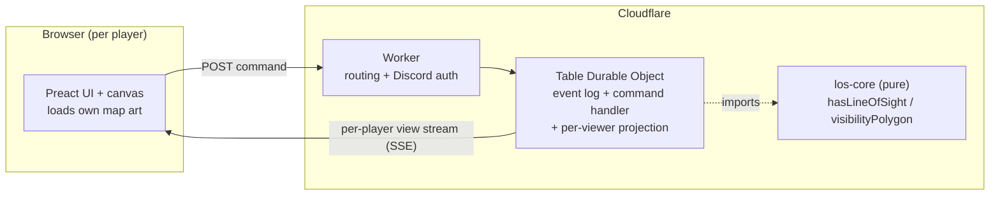
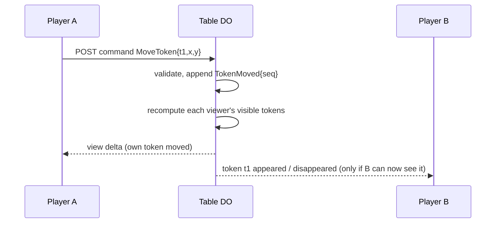

# Line of Sight Multiplayer

Design doc + progress tracker for evolving Line of Sight from a single-player
authoring tool into a multiplayer tabletop where each player has their own
server-authoritative point of view. This is a living document: we iterate on it
as we build, and the [Roadmap](#roadmap--progress) at the bottom tracks status.

Status: **design** — nothing here is built yet. It's a prototype; we favour the
smallest thing that proves each idea over completeness.

## Goal

Multiple players join a shared board. Each owns a counter and sees the map from
*that* counter's point of view. A player must not learn where other players'
(or hidden NPCs') counters are unless their own POV can actually see them.
A GM/referee sees everything and authors the board.

## What is actually secret (the crux)

Each client loads its **own local copy** of the map art (see
[Assets](#assets), consistent with the Local Asset Policy in
[`AGENTS.md`](../AGENTS.md)). So every client can already see the terrain — the
walls are drawn into the image. Hiding wall geometry from clients would buy
nothing.

Therefore the security boundary is **dynamic entity state, not terrain**:

| State | Secret? | Where it's decided |
| --- | --- | --- |
| Map art, board size, grid | No (client has the art) | Client-local, keyed by `assetRef` |
| Occluders (walls/doors), door open/closed | No (art reveals walls) | Shared to all clients |
| **Other players' / NPC token positions** | **Yes** | **Server-gated per viewer** |
| A player's own token(s) | Always visible to that player | Server |
| "Explored / never-seen" fog overlay | No — cosmetic | Client-local |

The server's job: for each viewer, send only the tokens that viewer's POV can
see. That gate is exactly `hasLineOfSight` from the existing core:

```
visibleTokensFor(viewer):
  own   = tokens owned by viewer            # always visible
  others = tokens NOT owned by viewer where
             distance(viewerPov, token) <= sightRadius
             AND hasLineOfSight(viewerPov, token, occluders, doorStates)
  return own + others            # GM: return all tokens
```

No new geometry code — `hasLineOfSight` / `visibilityPolygon` already exist and
are pure, so they run unchanged in a Worker / Durable Object. This is the main
reason the rest of the design is cheap.

### Movement (D&D 5e SRD)

Per [SRD movement rules](https://5e.d20srd.org/srd/combat/movementandPosition.htm),
on your turn you can move up to your **speed** (walking speed is **30 feet** for
most humanoids). Battle maps treat each square as **5 feet**.

The play client enforces both:

1. **Line of sight** — destination must be inside your current visibility polygon.
2. **Per-turn distance** — destination must be within your movement budget.

Defaults on publish: `feetPerSquare: 5`, `defaultMoveFeet: 30`. Board pixels use
`gridScale` (pixels per square), so 30 ft → 6 squares → `6 × gridScale` pixels
(e.g. 300 px when `gridScale` is 50).

The **GM** can override any counter’s budget with `SetTokenMoveFeet` (haste,
slow, monsters with different speeds, etc.). Overrides are stored on the token as
`moveFeet` and validated server-side on every `MoveToken`.

## Architecture overview



One Durable Object per table. The Worker is a thin router (+ auth); all game
state and coordination live in the DO. The deterministic core is imported by the
DO for visibility gating.

## Domain model

- **Table** — one game/session = one Durable Object instance, addressed by id.
- **Player** — an identity (Discord later; a name for now) that owns one or more
  tokens and has a POV (its active token).
- **GM / referee** — a player role that authors the board and sees all tokens.
- **Board** — the authored static state: `occluders`, `doorStates`, `boardSize`,
  `gridScale`, `assetRef`. This is the existing sidecar shape.
- **Token** — a counter with a position and an owner.

Two phases reuse the existing app:

1. **Authoring** (GM) — load maps, analyse, correct walls/doors. This is today's
   single-player flow; it produces a board the GM publishes to the table.
2. **Play** — players join, claim/own a token, move it, toggle doors; the server
   gates visibility per player.

## CQRS / event flow

Lightweight CQRS — no external infra. The DO is the command handler, the event
log, and the projector all at once.

- **Commands** (write side, client → server, validated): the intent.
- **Domain events** (server-internal log): the facts, each with a monotonic
  `seq`. State = fold over events (or snapshot + tail).
- **View stream** (read side, server → client): per-player projected updates —
  *not* the raw domain events. What player A receives depends on A's POV, so the
  read model is genuinely different per player (this is why CQRS fits).



Example shapes (illustrative, not final):

```ts
type Command =
  | {type: 'JoinTable'; name: string}
  | {type: 'ClaimToken'; tokenId: string}
  | {type: 'MoveToken'; tokenId: string; x: number; y: number}
  | {type: 'ToggleDoor'; doorId: string; open: boolean}
  | {type: 'SetPov'; tokenId: string}
  | {type: 'PublishBoard'; sidecar: Sidecar} // GM

type DomainEvent = {seq: number} & (
  | {type: 'PlayerJoined'; playerId: string; name: string}
  | {type: 'TokenClaimed'; tokenId: string; playerId: string}
  | {type: 'TokenMoved'; tokenId: string; x: number; y: number}
  | {type: 'DoorToggled'; doorId: string; open: boolean}
  | {type: 'BoardPublished'; sidecar: Sidecar}
)
```

Notes:
- **Granularity:** emit `TokenMoved` on drag *end* (pointer up), like the app
  commits today — not per mouse-move. Intermediate drag stays local/optimistic.
- **Optimistic UI:** a client applies its own token move immediately, then
  reconciles when the authoritative event echoes back.
- The snapshot undo stack already in the app is a primitive version of this —
  same instinct, lifted to the server.

## Durable Object design

One DO per table owns:
- the event log + `seq` and the folded current state;
- command validation + application (single-threaded execution → commands are
  serialized for free, no locks, no races — this is the CQRS write side);
- the set of connected viewers (identity + POV + stream writer);
- per-event projection: recompute affected viewers' visible-token sets and push
  view deltas.

For a prototype, recomputing all viewers on every event is fine (few players,
few tokens, cheap geometry). Persistence can start in-memory and move to DO
storage (KV-style, or SQLite-in-DO for a queryable log) when we want restart
durability + reconnection catch-up.

## Transport: SSE + a single command POST

Decision: **Server-Sent Events for the read stream, one POST endpoint for
commands.** Rationale:

- Command rate is human-paced (move a token, toggle a door) — no need for
  WebSocket's bidirectional low latency.
- It maps cleanly onto CQRS: POST is the command channel, SSE is the read
  channel.
- SSE gives **free reconnect/catch-up** via `Last-Event-ID` + event `seq`: a
  dropped client reconnects and we replay/refresh from where it left off.
- It's just HTTP — simpler to build and debug.

**Upgrade trigger:** the one strong reason to switch to WebSockets is the DO
**WebSocket Hibernation API**, which lets idle tables keep a connection while the
DO sleeps (cheaper at scale). Not worth it for a prototype. We keep the
command/event layer transport-agnostic (an adapter), so SSE → WS is a swap, not
a rewrite.

## HTTP surface

Deliberately tiny — one command endpoint, one stream, plus auth/lobby. No
per-resource REST sprawl.

```
POST /api/tables              create a table -> { tableId }
POST /api/tables/:id/commands body: Command -> { accepted, seq } | error
GET  /api/tables/:id/stream   SSE: snapshot, then per-player view deltas
GET  /auth/discord            OAuth2 start            (Phase 3)
GET  /auth/discord/callback   OAuth2 callback         (Phase 3)
```

All `/api/tables/:id/*` requests route to that table's DO. On (re)connect the
stream sends a full per-player snapshot first, then deltas.

## Auth

**To start: no auth at all.** A player is just a connection — the server assigns
an ephemeral player id when they open the stream (optionally with a typed display
name). Nothing is gated, no accounts, no login. This keeps the whole first build
focused on the novel risk (the multiplayer-POV loop) instead of auth plumbing.

**Later (Phase 3): Discord OAuth2** authorization-code flow on the Worker — we
only need identity (Discord user id + display name) → map to a player; we don't
store tokens we don't need; session via a signed cookie. Added once the core loop
works, because auth is well-trodden and not where the risk is.

## Assets (GM-uploaded maps)

The **GM uploads the map**, and it must be loadable by **all** clients in the
game — so the server *does* store map art, in a **private R2 bucket**, served
only through the Worker. It is never a public/crawlable URL and never a public
bucket.

Flow:
1. GM `POST`s the image to `/api/tables/:id/map` → Worker stores it in R2 under
   an unguessable key `:id/<uuid>` → returns `{assetRef}`.
2. GM publishes a board carrying that `assetRef` (the existing sidecar field).
3. Every client `GET`s `/api/tables/:id/map/<assetRef>`; the Worker streams the
   bytes from the private bucket (`Cache-Control: private`). A client without the
   asset can still play on a blank board with the occluder overlay.

Privacy, honestly stated for a prototype: the bucket is private and bytes are
only reachable through the Worker route, so maps are not "just shared on the
internet." With **no auth yet**, anyone who knows `tableId` + the `uuid` assetRef
can fetch — i.e. link-private (unguessable), not access-controlled. When Discord
auth lands, the serve route gets gated on game membership at that single point.

Responsibility: maps are user-generated content the GM chooses to upload; we
store them privately but are not the arbiter of what a group uses for its game.
A light guard caps uploads to `image/*` under 25 MB so the bucket stays a map
store, not a general file host.

Relation to the repo's Local Asset Policy: unchanged. That policy
([`AGENTS.md`](../AGENTS.md)) governs *dev* assets in git (`Geomorphs/`,
`Counters/` — never committed or deployed). GM uploads live in R2 at runtime,
never in git or the deployed bundle, so the two don't conflict.

## Reusing the deterministic core

`los-core.ts` is pure (no DOM/Cloudflare) and already unit-tested, so the DO can
import it directly for `hasLineOfSight` / `visibilityPolygon`. One structural
task: it currently lives under `web/src/` (the browser bundle). Move it to a
location both the browser build and the Worker/DO build import cleanly (e.g. a
shared module), keeping the layered-separation rule intact. No logic changes.

## Decisions log

- **Server-authoritative on token positions** (not terrain). Terrain isn't
  secret because clients hold the art; tokens are the hidden information.
- **CQRS-lite, event-sourced in the DO.** No external bus/store; the DO is
  handler + log + projector. Read model is per-player by construction.
- **One Durable Object per table.** Single-threaded execution = free command
  ordering.
- **SSE + single POST**, transport-agnostic; WS+hibernation is the later upgrade
  if idle cost matters.
- **No auth to start** — ephemeral server-assigned player ids. Discord OAuth is
  added only after the core loop works.
- **GM-uploaded maps stored privately in R2**, served only via the Worker
  (private bucket, unguessable key), synced by `assetRef`. Auth-gated later.

## Open questions

- Token ownership: one token per player, or several? Can players control NPCs?
- Does the GM author live in the same session as play, or publish then start?
- Do we persist tables across restarts in the prototype, or treat them as
  ephemeral?
- Multiple tables / a lobby — needed for the prototype, or one hardcoded table?
- Should door-open/closed ever be hidden (a door you can't see)? Probably not
  for v1.

## Roadmap / progress

Status keys: `[ ]` not started · `[~]` in progress · `[x]` done.

### Phase 0 — Foundations
- [ ] Make `los-core` importable by both the browser and the Worker/DO build.
- [ ] Define shared `Command` / `DomainEvent` / `Sidecar` types.
- [ ] Stub `Table` Durable Object + Worker routing to it by table id.

### Phase 1 — The core loop (prove the hard thing)
- [ ] `POST /api/tables/:id/commands` → DO applies `MoveToken`.
- [ ] `GET /api/tables/:id/stream` SSE with per-player snapshot + deltas.
- [ ] Per-player token gating via `hasLineOfSight`.
- [ ] No auth: server assigns an ephemeral player id on connect; each player
      owns one token.
- [ ] Demo: two browsers, two POVs, each sees the other's token only when in
      view.

### Phase 2 — Real-ish play
- [ ] `ToggleDoor` affecting visibility; doors re-gate token sight.
- [ ] Token claim/ownership; GM role sees all tokens.
- [x] Private R2 map storage: `POST/GET /api/tables/:id/map[/:ref]`
      (image-only, ≤25 MB, served through the Worker — not public).
- [ ] GM publishes a board (`assetRef` + occluders) so the DO broadcasts it and
      clients fetch the uploaded map.
- [ ] Event-log persistence in DO storage + `Last-Event-ID` reconnect catch-up.

### Phase 3 — Discord auth
- [ ] OAuth2 code flow on the Worker; session cookie; player identity.
- [ ] Gate join/commands on auth.

### Phase 4 — Hardening (prototype-level)
- [ ] Optimistic-UI reconciliation polish.
- [ ] Reconnection robustness.
- [ ] Consider WS + DO hibernation if idle-table cost matters.
- [ ] Multiple tables / simple lobby.
