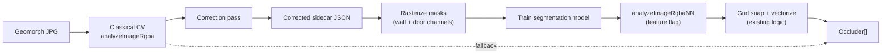

# Neural Wall & Door Detection (Research Branch)

This document describes the plan for a **feature branch experiment**: train a
small neural model to detect walls and doors on Geomorph map tiles, using our
existing classical CV pipeline as a bootstrap and the app’s sidecar format as
ground truth.

It is forward-looking work on branch `feature/nn-wall-detection`. Production
on `main` continues to use `analyzeImageRgba` in `web/src/los-core.ts` until
an NN path proves better on held-out maps.

## Plan review summary (after further research)

A second research pass (browser inference, small-dataset training, mask
vectorization, and noisy-label risk) confirmed the overall approach and changed
four things:

1. **Browser inference is viable** with ONNX Runtime Web + WebGPU and a WASM
   fallback, if the model is kept small (FP16, static shapes, ≲100 MB). The app
   already probes WebGPU in `web/src/gpu.ts`. See
   [Browser inference feasibility](#browser-inference-feasibility).
2. **Agent-generated corrections are pseudo-labels and can inject noise** that
   measurably degrades segmentation training. We add explicit label-quality
   controls (CV/agent agreement, human spot-check, noise-robust loss). See
   [Label quality and noise control](#label-quality-and-noise-control).
3. **Mask → vector is a known, non-trivial step** with established solutions
   (box-fitting beats naive simplification; skeleton + graph normalization).
   Our existing snap/merge logic plays this role; we reference the literature.
   See [Mask to vector post-processing](#mask-to-vector-post-processing).
4. **The app is currently export-only** (`ARCHITECTURE.md`: "the app does not
   currently re-import sidecars"). The correction loop needs a **sidecar
   importer** so corrected/agent-edited labels can round-trip into the editor.
   This is now a prerequisite, not an afterthought.
5. **Train on Modal, infer in the browser.** Modal (serverless GPUs) removes the
   training-infra cost and even makes a foundation-model fine-tune affordable, but
   model *size* is not the bottleneck here — labels and domain fit are. Keep
   inference in-browser (ONNX Runtime Web) to preserve the local-first model;
   hosting inference on Modal would mean uploading user maps and is a product
   decision. See [Training and hosting (Modal)](#training-and-hosting-modal).

> **Bottom line:** worth a one-day triage first — measure how much correction the
> current classical output actually needs across a stratified sample. That number,
> not model architecture or where we train, decides whether the NN is worth
> building.

## Goal

Improve wall and door extraction on Geomorph JPGs (Standard, Edge, Corner) while
preserving the deterministic core contract:

- Input: RGBA buffer + dimensions + grid scale
- Output: `Occluder[]` (axis-aligned wall segments + door segments)
- Downstream: `hasLineOfSight`, `visibilityPolygon`, sidecar export, `/play`

The NN is an **optional replacement or refinement** for the detection stage
inside that boundary—not a rewrite of visibility geometry or the UI.

## Why start from classical CV

The current pipeline (grid geometry, orthogonal wall extraction, floor-plan
filtering, compact-tile handling) already:

- Runs on all 400 local Geomorph maps with no zero-wall failures
- Produces reviewable candidates in the Edit tab
- Exports the exact sidecar JSON shape we need for labels

That matches a well-established ML pattern: **weak labels → correction →
supervised training**. Academic floor-plan work rarely starts from perfect manual
annotations; it starts from heuristics or coarse models and refines labels before
training.

Our classical detector is the weak label generator. It is not throwaway code—it
remains the fallback, a pseudo-label source, and the post-processing layer after
NN inference.

## Pipeline overview



### Phase 1 — Label generation (bootstrap)

1. Run classical detection on each Geomorph tile (benchmark script or app
   Analyze).
2. Produce an initial occluder set per map.
3. Measure error on a held-out set (wall count, door count, visual overlays).

### Phase 2 — Correction pass (ground truth)

Corrections must happen in terms the app already understands: move/add/delete
wall and door segments in the Edit tab, then export sidecar JSON.

**Correction does not have to be manual.** The same review step can be done by
an coding agent (Cursor, Codex, etc.) with access to:

- The source JPG
- Detection overlay PNGs (e.g. `scripts/visual-check-detection.mjs`)
- Benchmark stats (`scripts/benchmark-all-geomorphs.mjs`)
- The sidecar JSON schema from [`ARCHITECTURE.md`](ARCHITECTURE.md)

A typical agent loop:

1. Run CV on a map; render overlay or read occluder list.
2. Compare overlay to the map image (missed walls, furniture false positives,
   missing doors).
3. Edit occluders programmatically or via scripted sidecar patches.
4. Re-export sidecar; spot-check in the app or with overlay script.

This is **human-in-the-loop** in the research sense (expert review before labels
enter training), but the “expert” can be an agent operating on visual evidence
rather than a person clicking every segment.

> **Prerequisite — sidecar import.** The app today is export-only
> (`ARCHITECTURE.md`, Sidecar format). The correction loop needs a **sidecar
> importer** so an agent (or person) can edit a sidecar, reload it into the
> editor, and verify it visually before it becomes a label. Building a small,
> well-tested `importSidecar` is the first concrete task on this branch.

### Label quality and noise control

Agent corrections are **pseudo-labels**. The semi-supervised segmentation
literature is consistent that wrong pseudo-labels degrade the final model — the
worst ~10% by confidence are actively harmful, and confidence filtering alone is
not sufficient to catch them ([Pseudo-Label Noise Suppression,
2022](https://ar5iv.labs.arxiv.org/html/2210.10426)). VLM/image-level models in
particular localize poorly and produce noisy dense predictions
([SemiVL](https://arxiv.org/html/2311.16241)). Treat agent-edited sidecars with
the same suspicion.

Controls we will apply:

- **Two-source agreement.** Keep both the classical CV occluders and the agent's
  corrected set; flag maps where they disagree heavily for human review (this is
  also the active-learning signal in the AAAI HITL work).
- **Human spot-check.** Review a sample (≈10%) of corrected maps, weighted toward
  high-disagreement and hard tiles (hangars, cargo, curved rooms), before any
  training run.
- **Noise-robust training.** Use Dice/Tversky plus a noise-tolerant term
  (e.g. Symmetric Cross-Entropy) and pseudo-label loss weighting rather than
  trusting every labeled pixel equally.
- **Provenance metadata.** Record per-sidecar whether labels are CV-only,
  agent-corrected, or human-verified, so we can train on, ablate, or down-weight
  each tier.

### Phase 3 — Training set construction

For each corrected sidecar paired with its JPG:

| Artifact | Purpose |
|----------|---------|
| `{map}.jpg` | Model input |
| `{map}.wall.png` | Binary (or soft) wall mask |
| `{map}.door.png` | Binary door/opening mask |
| `{map}.sidecar.json` | Source of truth vectors + metadata |

Rasterize occluder segments into masks at native tile resolution (1000×1000,
530×530, 1000×530, etc.). Preserve `gridScale` and derived geometry metadata for
evaluation.

Store under `training/` (gitignored) or a separate data repo—Geomorph JPGs stay
local-only per [`AGENTS.md`](../AGENTS.md).

### Phase 4 — Model training

**Recommended first target:** two-class semantic segmentation (wall + door/opening).

Reasons (supported by floor-plan literature):

- Easy to generate labels from corrected sidecars
- Handles thin structures with Dice/Tversky loss
- Lets us reuse deterministic **mask → grid-snapped segments** post-processing
- More robust to furniture noise than raw line-segment regression when combined
  with our floor-plan filters

Training stack (proposed, not fixed):

- Python + PyTorch
- Small U-Net or lightweight encoder–decoder (SegFormer/MiT-style)
- Loss: Tversky or Dice (thin walls are the hard case in multiple papers),
  optionally combined with Symmetric Cross-Entropy for noise tolerance
- **Transfer learning**: start from a pretrained backbone (e.g. MobileNetV2 /
  ImageNet, or a CubiCasa wall model) — repeatedly shown to make hundreds- or
  even tens-of-images datasets workable

#### Dataset size and augmentation

Research on data-efficient U-Nets shows useful segmentation from **hundreds, or
even ~10–100, labeled images** when augmentation and transfer learning are used
(e.g. data-efficient U-Net on 10 SEM images; golf-course segmentation on <100
images reaching Dice ≈ 0.75). Our ~400 Geomorph tiles are comfortably in range.

Augmentation must respect the domain — aggressive geometric warps can destroy
thin structures:

- **Safe and meaningful:** 90°/180°/270° rotations and H/V flips. Geomorphs are
  grid-aligned, so these preserve wall geometry and multiply data ~8×.
- **Use with care:** brightness/contrast/blur/JPEG noise (these maps are JPEGs,
  so mild compression noise is realistic and helpful).
- **Avoid:** small-angle rotation, shear, and elastic warps — they blur the
  fixed 50/53 px grid and thin walls the model most needs to learn.
- **Tiling option:** train on grid-aligned crops (e.g. 256×256) to increase
  sample count and keep input sizes static for WebGPU.

#### Training and hosting (Modal)

Train on [Modal](https://modal.com) (serverless GPUs, pay-per-use). It removes the
biggest infra cost in this plan and fits the iterate loop: correct labels → kick a
Modal job → pull weights. Even a foundation-model fine-tune (see below) is
affordable there.

**Model size is not the bottleneck — labels and domain fit are.** With ~400
domain-specific maps, a larger from-scratch model mostly overfits faster; the
small-dataset literature consistently favours *small* models + transfer learning
+ augmentation. "Bigger" only helps in one specific form:

- **Foundation-model fine-tune** (e.g. SAM for masks, or a large pretrained
  segmentation backbone): inherit general structure-vs-clutter priors, then
  fine-tune on geomorphs. This is the version where Modal's bigger GPUs earn their
  keep — not training a large U-Net from scratch.

**Train on Modal, infer in the browser (preferred).** Keep the architecture
local-first:

1. Train (and optionally fine-tune a foundation model) on Modal.
2. Export to **ONNX**.
3. Ship weights; run inference **in-browser** via ONNX Runtime Web + WebGPU
   (WASM fallback).

Modal does the heavy lifting once; the deployed app stays serverless and never
uploads user maps.

**Hosting inference on Modal is a product decision, not just a deploy detail.**
It would mean **uploading the user's map image to a server** for inference, which
breaks the local-first / no-upload model (`AGENTS.md`: users select their own map
images in the browser; the Worker is a thin static shell). It also adds latency,
a network dependency, and a warm-GPU cost. Only consider server-side inference if
a model is genuinely too large for the browser — and per the point above, it
should not need to be. If it is ever required, route it through the Cloudflare
Worker to a Modal endpoint behind an explicit, opt-in flag, and document the
privacy change.

### Phase 5 — Integration

Keep the public API:

```ts
analyzeImageRgba(width, height, rgba, gridScale): Occluder[]
```

Add a parallel path (feature flag / env):

```ts
analyzeImageRgbaNN(...)  // ONNX or WASM runtime in browser, or offline tool first
```

Flow: NN masks → existing vectorization (snap, merge, suppress duplicates,
network filter) → `Occluder[]`. Classical path stays when NN is off or
low-confidence.

#### Browser inference feasibility

In-browser segmentation is realistic in 2026 and fits the local-asset,
no-server-upload model best:

- **Runtime:** ONNX Runtime Web with the **WebGPU** execution provider and a
  **WASM fallback** (`executionProviders: [{name:'webgpu'}, {name:'wasm'}]`).
  The app already has a WebGPU capability probe in `web/src/gpu.ts` to gate this.
- **Budget:** keep the model **≲100 MB** (FP16 weights), use **static input
  shapes** to enable graph capture, and warm up once (first run pays a
  ~50–200 ms shader-compile cost; cache the session).
- **Throughput:** ResNet-50-class models run ~15–30 ms on desktop GPUs and
  ~30–60 ms on mobile via WebGPU, vs 300–500 ms on CPU/WASM. A small U-Net on
  256×256 tiles is well within interactive budget; tile a 1000×1000 map and
  stitch.
- **Fallbacks:** if WebGPU is absent or the model is too heavy, fall back to
  WASM inference or to the classical `analyzeImageRgba`. An offline Node/Python
  inference tool is the simplest first integration before wiring the browser.

This keeps the deterministic-core boundary intact: the model produces masks; a
pure post-process turns masks into `Occluder[]`.

#### Mask to vector post-processing

Turning a segmentation mask into clean, axis-aligned segments is a known,
non-trivial step — naive contour simplification (Ramer–Douglas–Peucker) yields
jagged "sawtooth" walls. The literature favours geometry-aware methods:

- **Box-fitting** (Barreiro-style rectangle fitting) reconstructs coherent wall
  rectangles from imperfect masks and beats RDP simplification.
- **Skeletonization** (Zhang–Suen / Lee) + **graph normalization** (spur
  pruning, junction stabilization, collinear merge) — see the `mask2graph`
  approach for a deterministic, reproducible pipeline.
- **Geometric regularization**: snap endpoints, enforce orthogonality, merge
  collinear runs.

Our existing core already does much of this (grid snap, `mergeAxisCandidates`,
`removeRedundantCandidates`, network filter). The plan is to **reuse it as the
mask post-processor**, adding box-fitting / skeleton steps only if the mask
boundaries prove too noisy for the current snapping logic.

## Research this plan draws on

### Benchmarks and datasets

| Resource | Link | Relevance |
|----------|------|-----------|
| **CubiCasa5K** — 5k floorplans, polygon labels for walls, doors, windows, rooms | [Paper](https://arxiv.org/abs/1904.01920), [GitHub](https://github.com/CubiCasa/CubiCasa5k) | Standard task formulation: segmentation + heatmaps → vectors. Optional pretrain domain. |
| **Liu et al. floorplan vectors** | [ICCV 2017 project](http://art-programmer.github.io/floorplan-transformation.html), [Code](https://github.com/art-programmer/FloorplanTransformation) | Large-scale vector labels; junction + wall/door line format similar to our occluders. |

### Segmentation and multi-task models

| Paper | Link | Takeaway |
|-------|------|----------|
| **MuraNet** (2023) | [arXiv:2309.00348](https://arxiv.org/abs/2309.00348) | Joint wall segmentation + door/window detection on CubiCasa5K. |
| **MitUNet** (2025) | [arXiv:2512.02413](https://arxiv.org/abs/2512.02413), [Code](https://github.com/aliasstudio/mitunet) | Thin-wall segmentation; Tversky loss; U-Net decoder with skip connections. |
| **Self-constructing GCN** (2024) | [Automation in Construction](https://www.sciencedirect.com/science/article/pii/S0926580524003856) | `WallNet` predicts `{wall, opening, background}`—close to our two-channel target. |

### Raster-to-vector and junction methods

| Paper | Link | Takeaway |
|-------|------|----------|
| **Raster-to-Vector** (Liu et al., ICCV 2017) | [Paper](https://openaccess.thecvf.com/content_iccv_2017/html/Liu_Raster-To-Vector_Revisiting_Floorplan_ICCV_2017_paper.html) | Junction heatmaps + integer programming → wall/door lines. Validates **NN + deterministic assembly** over end-to-end vectors alone. |
| **CubiCasa5K model** (Kalervo et al., 2019) | [Paper](https://arxiv.org/abs/1904.01920) | Extends junction pipeline with multi-task segmentation and learned loss weighting. |

### Line / wireframe detection (secondary reference)

| Paper | Link | Takeaway |
|-------|------|----------|
| **L-CNN** (ICCV 2019) | [arXiv:1905.03246](https://arxiv.org/abs/1905.03246), [Code](https://github.com/zhou13/lcnn) | Direct line segments from images. Useful reference but likely noisy on furniture-heavy geomorphs without heavy filtering. |

### Sequence / VLM vectorization (long-term)

| Paper | Link | Takeaway |
|-------|------|----------|
| **FloorplanVLM** (2026) | [arXiv PDF](https://arxiv.org/pdf/2602.06507) | Emits structured JSON topology. Interesting for full vector output; heavy infra for v1. |
| **Raster2Seq** (2026) | [HTML](https://arxiv.org/html/2602.09016) | Autoregressive polygon sequences. |

### Human-in-the-loop, pseudo-labels, active learning

| Paper | Link | Takeaway |
|-------|------|----------|
| **HITL object detection in floor plans** (AAAI) | [AAAI](https://ojs.aaai.org/index.php/AAAI/article/view/21522) | Uncertainty-guided review; selective labeling improved accuracy ~13%. Synthetic data for new projects. |
| **Mask-aware semi-supervised detection** (DFKI, 2022) | [PDF](https://www.dfki.uni-kl.de/~pagani/papers/Shehzadi2022_AppliedSciences.pdf) | Teacher pseudo-labels + small labeled set; student refinement. |
| **Progressive active learning on floorplans** | [PMC](https://pmc.ncbi.nlm.nih.gov/articles/PMC10533859/) | Seed labels → model-assisted completion → expert correction pass. |
| **Weak supervision (Snorkel)** | [Guide](https://snorkel.ai/data-centric-ai/weak-supervision/) | Combining noisy labeling functions—our classical CV is one such function. |

### Pseudo-label noise (why agent labels need controls)

| Paper | Link | Takeaway |
|-------|------|----------|
| **Pseudo-Label Noise Suppression** (2022) | [arXiv:2210.10426](https://ar5iv.labs.arxiv.org/html/2210.10426) | Wrong pseudo-labels hurt; worst ~10% confidence are harmful; confidence filtering alone is insufficient. Use SCE loss + loss weighting. |
| **SemiVL** (2023) | [arXiv:2311.16241](https://arxiv.org/html/2311.16241) | VLMs localize poorly and give noisy dense predictions; anchor with high-confidence, frozen guidance. Argues for not trusting image-level model labels directly. |

### Browser inference

| Resource | Link | Takeaway |
|----------|------|----------|
| **ONNX Runtime Web — WebGPU** | [Docs](https://onnxruntime.ai/docs/tutorials/web/ep-webgpu.html) | WebGPU EP + WASM fallback; static shapes + graph capture; IO binding to avoid CPU↔GPU copies. |
| **PyTorch in the browser (2026)** | [Guide](https://techbytes.app/posts/pytorch-browser-wasm-webgpu-tutorial-2026/) | Author in PyTorch, export ONNX, run with ORT Web; keep inputs small and fixed-size; FP16. |
| **Modal** (serverless GPU training) | [modal.com](https://modal.com) | Pay-per-use GPUs for training / foundation-model fine-tune; export ONNX and infer in-browser to stay local-first. |

### Small-dataset segmentation and mask→vector

| Resource | Link | Takeaway |
|----------|------|----------|
| **Data-efficient U-Net** (2025) | [arXiv:2511.11485](https://arxiv.org/html/2511.11485) | Lightweight U-Net trained on ~10 images via tiling + augmentation; generalized to a new domain. |
| **Limited-data segmentation (Albumentations + transfer)** | [Guide](https://developmentseed.org/tensorflow-eo-training-2/docs/Lesson6b_dealing_with_limited_data.html) | Augmentation + pretrained backbone + Dice loss for small, imbalanced sets. |
| **Post-processing masks → vector floorplans** (thesis) | [PDF](https://www.diva-portal.org/smash/get/diva2:1987376/FULLTEXT01.pdf) | Barreiro box-fitting beats RDP; removes jagged edges from imperfect masks. |
| **mask2graph** | [GitHub](https://github.com/farzadhallaji/mask2graph) | Deterministic skeleton → junction-stabilized graph with spur pruning; reproducible mask-to-topology. |

### Adjacent product (game maps, classical CV)

| Resource | Link | Takeaway |
|----------|------|----------|
| **Auto-Wall** (TTRPG VTT) | [GitHub](https://github.com/ThreeHats/auto-wall) | Canny/color detection + **manual/agent refinement** + export. Same UX pattern; no published NN training loop. |

## Domain gap (Geomorphs vs academic floor plans)

Research datasets use architectural CAD-style drawings. Geomorphs add:

- Fixed tile sizes (1000×1000, 530×530, 1000×530) and 50/53 px grids
- Furniture, cargo containers, labels, and decorative hatching
- Curved or diagonal room art (e.g. Stellar Cartography) with mostly orthogonal
  gameplay walls

Expect **transfer from CubiCasa to help wall pixels but not furniture
discrimination**. Corrected Geomorph sidecars (whether from agents or humans) are
the high-value training signal.

## What we will build on this branch (planned)

| Item | Description |
|------|-------------|
| **`importSidecar` + tests** | **Prerequisite.** Round-trip sidecar JSON back into the editor so corrected/agent labels can be reloaded and verified. |
| `training/README.md` | How to lay out data locally + label provenance tiers |
| `training/export-cv-labels.mjs` | Batch classical detection → draft sidecars for correction |
| `training/rasterize-sidecar.mjs` | Sidecar JSON → wall/door PNG masks (native + tiled) |
| `training/agreement.mjs` | CV vs agent-corrected diff → flag high-disagreement maps for human review |
| `training/evaluate.mjs` | Compare CV vs NN vs corrected GT on held-out maps (segment F1, not raw counts) |
| `training/train/` (Python) | Segmentation training: U-Net + transfer learning, Dice/Tversky (+SCE), grid-safe augmentation |
| `analyzeImageRgbaNN` | Optional NN inference path (ONNX Runtime Web + WASM fallback) behind a feature flag |

Scripts that already support this work:

- `scripts/benchmark-all-geomorphs.mjs` — metrics over all 400 maps
- `scripts/visual-check-detection.mjs` — overlay PNGs for agent/human review
- `scripts/live-smoke-test.mjs` — live site smoke test after deploy

## Success criteria

Before merging any NN path to `main`:

1. **Held-out Geomorph set** (never used in training): NN + post-process beats
   classical on wall/door F1 or equivalent segment metrics, judged on corrected
   sidecars—not raw wall counts alone.
2. **Visual review** on hangars, cargo bays, corner tiles, and curved rooms.
3. **No regression** in `web/src/los-core.test.ts` for visibility geometry.
4. **Deterministic fallback** when NN is disabled or below confidence threshold.
5. **Browser-feasible inference** (ONNX Runtime Web or similar) unless we
   explicitly choose server-side inference.

## What stays classical permanently

- Line-of-sight and visibility polygon math
- Sidecar schema and export shape
- Grid snap, merge, and topology validation after NN masks
- Classical `analyzeImageRgba` as fallback and pseudo-label generator

## Suggested execution order

0. **Sidecar import:** Add and test `importSidecar` so labels round-trip into the
   editor. Without this, the correction loop cannot be verified visually.
1. **Seed set:** Pick ~30–50 diverse maps; run CV; agent-correct sidecars with
   overlay feedback; record provenance; human spot-check ~10% (high-disagreement
   and hard tiles first).
2. **Rasterize:** Build `training/rasterize-sidecar.mjs`; verify masks align with
   JPG walls/doors at native and tiled resolution.
3. **Baseline train:** Small U-Net (pretrained backbone) on seed set with
   grid-safe augmentation; evaluate on held-out tiles with segment F1.
4. **Scale labels:** Agent-correct more maps; use CV/agent disagreement as the
   active-learning signal for what to review next.
5. **Integrate:** `analyzeImageRgbaNN` (offline tool first, then ONNX Runtime
   Web behind a flag); reuse core vectorization as the mask post-processor;
   benchmark vs classical; iterate.

## References in this repo

- [`ARCHITECTURE.md`](ARCHITECTURE.md) — sidecar format, analysis pipeline
- [`PATTERNS.md`](PATTERNS.md) — candidate → review → export
- [`AGENTS.md`](../AGENTS.md) — Geomorph asset policy, verification commands
