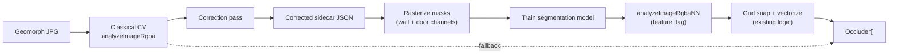

# Neural Wall & Door Detection (Research Branch)

This document describes the plan for a **feature branch experiment**: train a
small neural model to detect walls and doors on Geomorph map tiles, using our
existing classical CV pipeline as a bootstrap and the app’s sidecar format as
ground truth.

It is forward-looking work on branch `feature/nn-wall-detection`. Production
on `main` continues to use `analyzeImageRgba` in `web/src/los-core.ts` until
an NN path proves better on held-out maps.

## Goal

Improve wall and door extraction on Geomorph JPGs (Standard, Edge, Corner) while
preserving the deterministic core contract:

- Input: RGBA buffer + dimensions + grid scale
- Output: `Occluder[]` (axis-aligned wall segments + door segments)
- Downstream: `hasLineOfSight`, `visibilityPolygon`, sidecar export, `/play`

The NN is an **optional replacement or refinement** for the detection stage
inside that boundary—not a rewrite of visibility geometry or the UI.

## Why start from classical CV

The current pipeline (grid geometry, orthogonal wall extraction, floor-plan
filtering, compact-tile handling) already:

- Runs on all 400 local Geomorph maps with no zero-wall failures
- Produces reviewable candidates in the Edit tab
- Exports the exact sidecar JSON shape we need for labels

That matches a well-established ML pattern: **weak labels → correction →
supervised training**. Academic floor-plan work rarely starts from perfect manual
annotations; it starts from heuristics or coarse models and refines labels before
training.

Our classical detector is the weak label generator. It is not throwaway code—it
remains the fallback, a pseudo-label source, and the post-processing layer after
NN inference.

## Pipeline overview



### Phase 1 — Label generation (bootstrap)

1. Run classical detection on each Geomorph tile (benchmark script or app
   Analyze).
2. Produce an initial occluder set per map.
3. Measure error on a held-out set (wall count, door count, visual overlays).

### Phase 2 — Correction pass (ground truth)

Corrections must happen in terms the app already understands: move/add/delete
wall and door segments in the Edit tab, then export sidecar JSON.

**Correction does not have to be manual.** The same review step can be done by
an coding agent (Cursor, Codex, etc.) with access to:

- The source JPG
- Detection overlay PNGs (e.g. `scripts/visual-check-detection.mjs`)
- Benchmark stats (`scripts/benchmark-all-geomorphs.mjs`)
- The sidecar JSON schema from [`ARCHITECTURE.md`](ARCHITECTURE.md)

A typical agent loop:

1. Run CV on a map; render overlay or read occluder list.
2. Compare overlay to the map image (missed walls, furniture false positives,
   missing doors).
3. Edit occluders programmatically or via scripted sidecar patches.
4. Re-export sidecar; spot-check in the app or with overlay script.

This is **human-in-the-loop** in the research sense (expert review before labels
enter training), but the “expert” can be an agent operating on visual evidence
rather than a person clicking every segment. Human spot-checking on a sample of
corrected maps is still recommended before trusting a training run.

### Phase 3 — Training set construction

For each corrected sidecar paired with its JPG:

| Artifact | Purpose |
|----------|---------|
| `{map}.jpg` | Model input |
| `{map}.wall.png` | Binary (or soft) wall mask |
| `{map}.door.png` | Binary door/opening mask |
| `{map}.sidecar.json` | Source of truth vectors + metadata |

Rasterize occluder segments into masks at native tile resolution (1000×1000,
530×530, 1000×530, etc.). Preserve `gridScale` and derived geometry metadata for
evaluation.

Store under `training/` (gitignored) or a separate data repo—Geomorph JPGs stay
local-only per [`AGENTS.md`](../AGENTS.md).

### Phase 4 — Model training

**Recommended first target:** two-class semantic segmentation (wall + door/opening).

Reasons (supported by floor-plan literature):

- Easy to generate labels from corrected sidecars
- Handles thin structures with Dice/Tversky loss
- Lets us reuse deterministic **mask → grid-snapped segments** post-processing
- More robust to furniture noise than raw line-segment regression when combined
  with our floor-plan filters

Training stack (proposed, not fixed):

- Python + PyTorch
- Small U-Net or lightweight encoder–decoder (SegFormer/MiT-style)
- Loss: Tversky or Dice (thin walls are the hard case in multiple papers)
- Optional pretrain on public floor-plan data, then fine-tune on Geomorph labels

### Phase 5 — Integration

Keep the public API:

```ts
analyzeImageRgba(width, height, rgba, gridScale): Occluder[]
```

Add a parallel path (feature flag / env):

```ts
analyzeImageRgbaNN(...)  // ONNX or WASM runtime in browser, or offline tool first
```

Flow: NN masks → existing vectorization (snap, merge, suppress duplicates,
network filter) → `Occluder[]`. Classical path stays when NN is off or
low-confidence.

## Research this plan draws on

### Benchmarks and datasets

| Resource | Link | Relevance |
|----------|------|-----------|
| **CubiCasa5K** — 5k floorplans, polygon labels for walls, doors, windows, rooms | [Paper](https://arxiv.org/abs/1904.01920), [GitHub](https://github.com/CubiCasa/CubiCasa5k) | Standard task formulation: segmentation + heatmaps → vectors. Optional pretrain domain. |
| **Liu et al. floorplan vectors** | [ICCV 2017 project](http://art-programmer.github.io/floorplan-transformation.html), [Code](https://github.com/art-programmer/FloorplanTransformation) | Large-scale vector labels; junction + wall/door line format similar to our occluders. |

### Segmentation and multi-task models

| Paper | Link | Takeaway |
|-------|------|----------|
| **MuraNet** (2023) | [arXiv:2309.00348](https://arxiv.org/abs/2309.00348) | Joint wall segmentation + door/window detection on CubiCasa5K. |
| **MitUNet** (2025) | [arXiv:2512.02413](https://arxiv.org/abs/2512.02413), [Code](https://github.com/aliasstudio/mitunet) | Thin-wall segmentation; Tversky loss; U-Net decoder with skip connections. |
| **Self-constructing GCN** (2024) | [Automation in Construction](https://www.sciencedirect.com/science/article/pii/S0926580524003856) | `WallNet` predicts `{wall, opening, background}`—close to our two-channel target. |

### Raster-to-vector and junction methods

| Paper | Link | Takeaway |
|-------|------|----------|
| **Raster-to-Vector** (Liu et al., ICCV 2017) | [Paper](https://openaccess.thecvf.com/content_iccv_2017/html/Liu_Raster-To-Vector_Revisiting_Floorplan_ICCV_2017_paper.html) | Junction heatmaps + integer programming → wall/door lines. Validates **NN + deterministic assembly** over end-to-end vectors alone. |
| **CubiCasa5K model** (Kalervo et al., 2019) | [Paper](https://arxiv.org/abs/1904.01920) | Extends junction pipeline with multi-task segmentation and learned loss weighting. |

### Line / wireframe detection (secondary reference)

| Paper | Link | Takeaway |
|-------|------|----------|
| **L-CNN** (ICCV 2019) | [arXiv:1905.03246](https://arxiv.org/abs/1905.03246), [Code](https://github.com/zhou13/lcnn) | Direct line segments from images. Useful reference but likely noisy on furniture-heavy geomorphs without heavy filtering. |

### Sequence / VLM vectorization (long-term)

| Paper | Link | Takeaway |
|-------|------|----------|
| **FloorplanVLM** (2026) | [arXiv PDF](https://arxiv.org/pdf/2602.06507) | Emits structured JSON topology. Interesting for full vector output; heavy infra for v1. |
| **Raster2Seq** (2026) | [HTML](https://arxiv.org/html/2602.09016) | Autoregressive polygon sequences. |

### Human-in-the-loop, pseudo-labels, active learning

| Paper | Link | Takeaway |
|-------|------|----------|
| **HITL object detection in floor plans** (AAAI) | [AAAI](https://ojs.aaai.org/index.php/AAAI/article/view/21522) | Uncertainty-guided review; selective labeling improved accuracy ~13%. Synthetic data for new projects. |
| **Mask-aware semi-supervised detection** (DFKI, 2022) | [PDF](https://www.dfki.uni-kl.de/~pagani/papers/Shehzadi2022_AppliedSciences.pdf) | Teacher pseudo-labels + small labeled set; student refinement. |
| **Progressive active learning on floorplans** | [PMC](https://pmc.ncbi.nlm.nih.gov/articles/PMC10533859/) | Seed labels → model-assisted completion → expert correction pass. |
| **Weak supervision (Snorkel)** | [Guide](https://snorkel.ai/data-centric-ai/weak-supervision/) | Combining noisy labeling functions—our classical CV is one such function. |

### Adjacent product (game maps, classical CV)

| Resource | Link | Takeaway |
|----------|------|----------|
| **Auto-Wall** (TTRPG VTT) | [GitHub](https://github.com/ThreeHats/auto-wall) | Canny/color detection + **manual/agent refinement** + export. Same UX pattern; no published NN training loop. |

## Domain gap (Geomorphs vs academic floor plans)

Research datasets use architectural CAD-style drawings. Geomorphs add:

- Fixed tile sizes (1000×1000, 530×530, 1000×530) and 50/53 px grids
- Furniture, cargo containers, labels, and decorative hatching
- Curved or diagonal room art (e.g. Stellar Cartography) with mostly orthogonal
  gameplay walls

Expect **transfer from CubiCasa to help wall pixels but not furniture
discrimination**. Corrected Geomorph sidecars (whether from agents or humans) are
the high-value training signal.

## What we will build on this branch (planned)

| Item | Description |
|------|-------------|
| `training/README.md` | How to lay out data locally |
| `training/rasterize-sidecar.mjs` | Sidecar JSON → wall/door PNG masks |
| `training/export-cv-labels.mjs` | Batch classical detection → draft sidecars for correction |
| `training/evaluate.mjs` | Compare CV vs NN vs corrected GT on held-out maps |
| `training/train/` (Python) | Segmentation training script (later) |
| Feature flag in UI or core | Optional NN inference path (later) |

Scripts that already support this work:

- `scripts/benchmark-all-geomorphs.mjs` — metrics over all 400 maps
- `scripts/visual-check-detection.mjs` — overlay PNGs for agent/human review
- `scripts/live-smoke-test.mjs` — live site smoke test after deploy

## Success criteria

Before merging any NN path to `main`:

1. **Held-out Geomorph set** (never used in training): NN + post-process beats
   classical on wall/door F1 or equivalent segment metrics, judged on corrected
   sidecars—not raw wall counts alone.
2. **Visual review** on hangars, cargo bays, corner tiles, and curved rooms.
3. **No regression** in `web/src/los-core.test.ts` for visibility geometry.
4. **Deterministic fallback** when NN is disabled or below confidence threshold.
5. **Browser-feasible inference** (ONNX Runtime Web or similar) unless we
   explicitly choose server-side inference.

## What stays classical permanently

- Line-of-sight and visibility polygon math
- Sidecar schema and export shape
- Grid snap, merge, and topology validation after NN masks
- Classical `analyzeImageRgba` as fallback and pseudo-label generator

## Suggested execution order

1. **Seed set:** Pick ~30–50 diverse maps; run CV; agent-correct sidecars with
   overlay feedback; human spot-check ~10%.
2. **Rasterize:** Build `training/rasterize-sidecar.mjs`; verify masks align with
   JPG walls/doors.
3. **Baseline train:** Small U-Net on seed set only; evaluate on held-out tiles.
4. **Scale labels:** Agent-correct more maps; active learning on maps with highest
   edit distance vs CV output.
5. **Integrate:** `analyzeImageRgbaNN` behind flag; benchmark; iterate.

## References in this repo

- [`ARCHITECTURE.md`](ARCHITECTURE.md) — sidecar format, analysis pipeline
- [`PATTERNS.md`](PATTERNS.md) — candidate → review → export
- [`AGENTS.md`](../AGENTS.md) — Geomorph asset policy, verification commands
