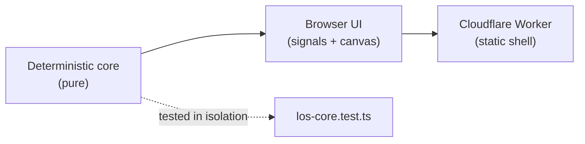
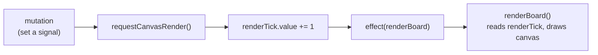
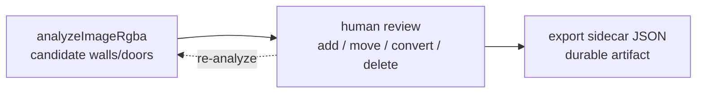

# Patterns

The load-bearing patterns in this codebase. Read this before non-trivial
changes — each section says what the pattern is, where it lives, why it has that
shape, and the gotchas that keep it working.



The deterministic core is the foundation: because it is pure, the UI leans on it
for every geometry question and it can be tested without a browser. The other
patterns are all about how the UI manages state on top of that core.

## Layered Separation

Three layers with a strict, one-directional dependency rule:

```
web/src/los-core.ts   Deterministic core   (no DOM, no Cloudflare, no Preact)
        ▲
web/src/main.tsx      Browser UI           (imports the core; owns DOM + state)
        ▲
src/worker.ts         Cloudflare Worker    (serves the built UI; no app logic)
```

The **core** depends on nothing in the repo. The **UI** imports the core and owns
everything browser-specific — the canvas, signals, pointer/keyboard input, and
the sidecar export. The **Worker** is a static shell: it serves `dist/client` and
answers `/healthz`, with no detection or visibility logic. The split is enforced
in [`AGENTS.md`](../AGENTS.md) under Coding Rules.

**Why:** keeping platform concerns out of the core is what makes it deterministic
and unit-testable; keeping app logic out of the Worker makes the app a plain
static SPA that runs anywhere — there is no server round-trip for analysis or
visibility.

**Gotchas:**

- Do not import `preact`, `document`, `window`, or Cloudflare types into
  `los-core.ts`. If it needs pixels, take a `Uint8ClampedArray`; if it needs a
  board, take numbers.
- The UI rasterises tiles to an offscreen canvas and passes the raw RGBA buffer
  into `analyzeImageRgba` — that is the only place pixels cross into the core.
- The previous Rust/WASM implementation lived behind this same boundary and is
  preserved on the `rust-wasm-version` branch.

## Deterministic Core

Every geometry and image-analysis function is **pure**: it depends only on its
arguments, performs no I/O, and returns the same result for the same inputs — no
randomness, no clock, no global mutable state. The three public entry points are
total functions of their inputs:

- `analyzeImageRgba(width, height, rgba, gridScale)` → `Occluder[]`
- `hasLineOfSight(from, to, occluders, doorStates)` → `boolean`
- `visibilityPolygon(x, y, width, height, radius, occluders, doorStates)` → `Point[]`

It lives in `web/src/los-core.ts`, exercised by `web/src/los-core.test.ts`.

**Why:** determinism is what makes the tool reviewable and testable. The same map
always yields the same candidates, so hand corrections stay meaningful between
runs; the core can be tested with synthetic RGBA buffers and plain occluder
arrays — no browser, no fixtures; and a failing case is fully described by its
inputs.

**Gotchas:**

- Door state is passed in as a `DoorStateLookup`, not read from the occluders, so
  visibility queries never mutate the occluder list. Accept both the `boolean`
  and `{open}` shapes, falling back to the door's own `open` field (`isOpenDoor`).
- Thresholds are derived from `gridScale` (`minRun`, `snap`, …), not hard-coded —
  keep new thresholds relative to the grid so behaviour scales with resolution.
- The caps (≤500 walls, ≤200 doors) are part of the contract; if you change them,
  update the [sidecar format](ARCHITECTURE.md#sidecar-format) and the
  [analysis pipeline diagram](diagrams/analysis-pipeline.dot).

See the full pipeline in
[the deterministic core](ARCHITECTURE.md#the-deterministic-core) and the
[analysis pipeline diagram](diagrams/analysis-pipeline.png).

## Signals and Rendering

All UI state lives in **module-level `@preact/signals` signals**, and the canvas
is redrawn by a **single reactive effect** wrapping an imperative draw function.
Mutations never call the renderer directly; they bump a counter signal.



`renderBoard` reads `renderTick.value` at its top so the effect subscribes to it;
anything that changes something visual calls `requestCanvasRender()`. The effect
is created once when `App` mounts and disposed on unmount. `renderBoard` draws in
a fixed order: map, grid, door markers, fog, range, tokens, debug walls, edit
overlay, preview.

**Why:** canvas drawing is imperative but app state is reactive. Routing every
change through one `renderTick` means there is exactly one place that draws the
board (so layering stays consistent), handlers never need a canvas reference, and
the Preact tree stays small — it renders the drawer/controls while the board is a
single `<canvas>` driven by the effect.

**Gotchas:**

- A new visual feature must call `requestCanvasRender()` after mutating state, or
  the canvas won't update.
- Keep the draw-order list in `renderBoard` authoritative — add new layers there,
  in position, rather than drawing ad hoc elsewhere.
- `renderBoard` early-returns when there is no map; guard new draw steps the same
  way.
- Offscreen canvases (`exploredCanvas`, `fogCanvas`) are module-level too — see
  [Snapshot Undo/Redo](#snapshot-undoredo) for what is and isn't part of undo.

## Snapshot Undo/Redo

Undo/redo is a **bounded stack of whole-state snapshots**, not a log of
reversible operations. Before a mutation, the editor state is deep-cloned into an
`EditorSnapshot` (capturing `occluders`, `doorStates`, `tokens`, and the
`selectedOccluderId` / `selectedTokenId` / `povTokenId` selection) and pushed onto
the undo stack. It lives in `web/src/main.tsx` (`editorSnapshot`,
`pushUndoHistory`, `undoEditorChange`, `redoEditorChange`,
`restoreEditorSnapshot`) with `undoStack` / `redoStack` signals and a
`historyLimit` of 60.

**Why:** the editable state is small (a few arrays of plain objects), so cloning
it whole is cheap and far simpler than maintaining an inverse per operation. A
snapshot also captures selection and POV, so undo restores *what you were looking
at*. Re-analysis, draws, and toggles all become "mutate state, then redraw" with
one shared history hook.

**Gotchas:**

- Call `pushUndoHistory()` **before** applying a mutation you want to be undoable.
- The stack is bounded at `historyLimit` (60); the oldest snapshots drop.
- The **explored fog** (`exploredCanvas`) is *not* in the snapshot — undo restores
  occluders/tokens/POV and then `markExplored()` recomputes visibility, but
  revealed area is canvas pixels, not state. The sidecar export, not undo, is the
  durable record.
- Clones must stay deep (`cloneOccluders`, `cloneTokens`, `cloneDoorStates`); a
  shallow copy would let a later mutation corrupt a stored snapshot.

## Candidate → Review → Export

Automatic detection is a **candidate generator only**. The pipeline never
produces an authoritative answer; it proposes walls and doors, the human reviews
and corrects them, and the **sidecar export** is the reviewed, durable artifact.



Generation is `analyzeImageRgba` in `web/src/los-core.ts`; review/re-analysis is
`analyzeTiles`, the editing tools, and `carveDoorGaps` in `web/src/main.tsx`;
export is `exportSidecar` (shape in
[sidecar format](ARCHITECTURE.md#sidecar-format)).

**Why:** raster maps are ambiguous — antialiasing, furniture, and labels all read
as dark pixels — so detection is always approximate. Rather than chase perfect
extraction, the tool optimises for fast human correction and a clean export, as
[`AGENTS.md`](../AGENTS.md) states directly.

**The `manual-` id convention** is the load-bearing detail that makes re-analysis
safe: detected occluders get position-ordered ids (`wall-0001`, `door-0001`, …)
while hand-drawn ones get a `manual-` prefix (`manual-wall-<hex>`,
`manual-door-<hex>`). `analyzeTiles` keeps `manual-` occluders and replaces only
the generated ones, so re-running analysis never discards corrections.

**Gotchas:**

- Anything that should survive re-analysis must carry the `manual-` prefix.
- Door open/closed state is overlay state (`doorStates`), not part of detection;
  export reflects each door's *current* toggled state.
- Export is one-way — the app does not re-import sidecars. If that changes, the
  `manual-` convention and id stability become an import concern too.
