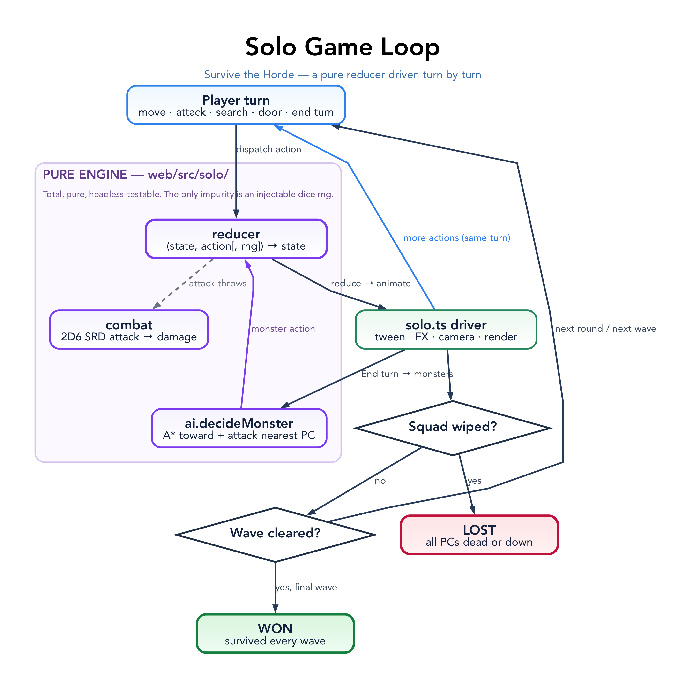

# Survive the Horde (single-player)

A static, client-only tactical game at `/solo` (`web/solo.html` → `web/src/solo.ts`),
served by the same Worker as the rest of the site. No server, no networking — the
computer runs the whole encounter in the browser.

## The game

Four pre-made characters board a generated starship deck and hold out against
three waves of aliens that board from the hull airlocks. Survive all three waves
to win; lose if the whole squad is dead or downed.

Turn-based in Cepheus initiative order (2D6 + DEX DM). Each turn is a single
budget — three **minor** actions, or one **significant** action (worth two
minors) plus a minor:

- **Move** (a minor per 6 m; click within the green ring) — gated by walkable
  floor, line of sight, and occupancy. Spend the whole budget to run up to 18 m.
- **Significant**: Attack a targeted foe, first aid with a Medkit, Aim, shove a
  crate, or hack a sealed door.
- **Minor**: open/close a door, badge through a keycard lock, Reload, Search a
  container, Pick up floor loot, or change stance.

Then **End turn** hands off to the monsters, which path toward the squad and
attack. Fog reveals the union of the squad's line of sight; monsters, loot, and
containers are seen only when a character can see them.

### Combat (Cepheus SRD)

Attack = `2D6 + skill + DEX DM + weapon×range-band DM` vs 8+. The **Effect**
(roll − 8) adds to weapon damage; armour subtracts; an Effect of 6+ always
inflicts at least 1. Damage falls on END first, then STR or DEX; STR or DEX at 0
downs a character, all three at 0 kills. A medkit restores `2 × Effect` of a
Medicine check. See [`web/src/solo/combat.ts`](../web/src/solo/combat.ts).

### Exploring

The squad boards **lightly armed — basic sidearms or a blade, no armour, little
spare ammo** — and scavenges the deck to gear up. Rooms hold **searchable
fixtures** — lockers, cabinets, supply crates, data terminals. Search one (a minor
action, when adjacent) to pocket its loot — ammo, medkits, a better **weapon**, a
set of **armour**, or an access card — and read any clue it holds. A weapon or
armour **equips on pickup** (found weapons come loaded), and the gear it replaces
drops to the floor for a squadmate. The same loot is scattered on the floor too;
**Pick up** grabs whatever you're standing by. Some internal
doors start **sealed**: a keycard lock opens for a card of the **matching
clearance** (a colour); a hack lock yields to an Electronics check, a significant
action that effectively needs the engineer (Kade) or scout (Rell). A padlock
marks a sealed door, coloured by its clearance (cyan for a hack), and a PC's
carried cards show as colour chips in the rail. Several doors can share a
clearance, so one card may open more than one; cards are not consumed by use.

Locks and loot are planned together (`web/src/solo/loot.ts`) so the player is
never softlocked: the squad can always reach **most of the deck from its spawn
without any card or hack** (sealed doors only ever gate side rooms, never the way
out), and every clearance in play has a matching card sitting in that freely
reachable area — so a card is never stranded behind the door it opens.

### Defending

Unlocked doors start open so the horde can roam. **Close a door** or **shove a
crate** into a corridor to physically block monster pathing — barricade a
chokepoint and fight them in the gap. A sealed room makes a temporary refuge once
you're through its lock.

## Shape



The engine is pure and headless-testable; the DOM/canvas shell is the only part
that touches the browser.

```
core/pathfinding.ts        A* (4-connected, canEnter + canStep), shared/pure
core/rules.ts, core/los.ts Cepheus rules + geometry (shared with the table app)
core/dice.ts               rollD6 / roll2D6 (seedable)
web/src/solo/model.ts      Entity, items, props, SoloState, Action (pure data)
web/src/solo/combat.ts     SRD attack/damage/first-aid resolution (pure)
web/src/solo/reducer.ts    (state, action[, rng]) => state — the whole game loop
web/src/solo/ai.ts         decideMonster: path toward + attack the nearest PC
web/src/solo/grid.ts       walkability derived from the generated deck
web/src/solo/loot.ts       searchable containers + locked doors (seeded, pure)
web/src/solo/characters.ts the four pre-gens · gear.ts weapons/armour · monsters.ts
web/src/solo/ccg.ts        adapter for cepheus-character-generator characters
web/src/solo.ts            canvas render, camera (zoom/pan), the turn driver
```

The **reducer** is total and pure (the only impurity is an injectable dice `rng`),
so a whole encounter replays from an action list and unit-tests without a DOM.
The **driver** in `solo.ts` is the only place animation and timing live: on the
player's End turn it runs each monster's plan from `decideMonster`, gliding its
steps (awaiting the movement tween) then attacking, with input locked.

## Cepheus family alignment

`web/src/solo/ccg.ts` maps a character from the
[Cepheus Character Generator](https://github.com/rgilks/cepheus-character-generator)
into the game's model — its
characteristics become `str/dex/end` (same names) and its `"Gun Combat-2"` skill
strings parse into a skill map; weapons/armour mirror its `Dmg`/`AR`/`Category`.
A generated character can drop into an encounter with minimal glue.
