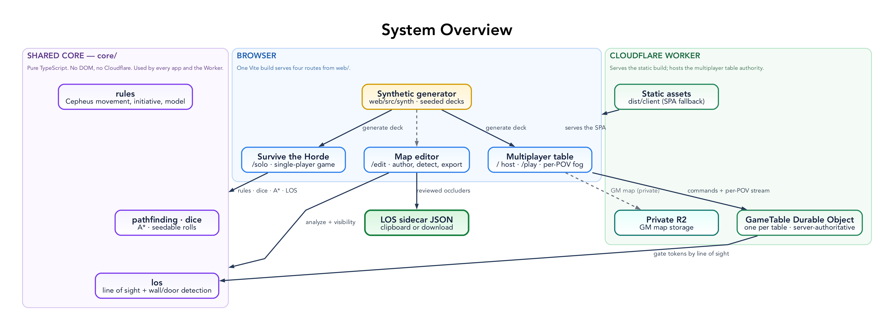

# Architecture

Line of Sight is a browser-first tool for extracting and reviewing visibility
metadata from geomorphic tactical maps. It is built from three layers with a
strict, one-directional dependency rule.



This document is the map of *what exists and where*. The
[patterns](patterns/README.md) explain *why each piece has its shape*; diagram
sources live in [`diagrams/`](diagrams/README.md).

## Layers

### 1. Deterministic core — `web/src/los-core.ts`

Pure TypeScript geometry and image analysis: no DOM, no Cloudflare, no Preact.
Given a raw RGBA buffer it produces candidate walls and doors; given occluders
and a viewpoint it answers line-of-sight queries and builds a visibility polygon.
Being side-effect free and deterministic, it is unit-tested in isolation
(`web/src/los-core.test.ts`).

Key exports:

- `analyzeImageRgba(width, height, rgba, gridScale)` → `Occluder[]`
- `hasLineOfSight(from, to, occluders, doorStates)` → `boolean`
- `visibilityPolygon(x, y, width, height, radius, occluders, doorStates)` → `Point[]`

See [los-core.md](los-core.md) for the detection pipeline and geometry.

### 2. Browser UI — `web/src/main.tsx`

A Preact app using `@preact/signals` for state, rendering the board to a 2D
`<canvas>`. It owns the whole interactive surface — arranging map tiles, running
analysis, hand-correcting walls/doors, placing counter tokens, toggling doors,
tracking visible and seen areas, and exporting the sidecar — and calls into the
core for all geometry. `web/src/gpu.ts` is a small runtime WebGPU capability
probe surfaced as a status string; the app renders with the 2D canvas regardless.

See [ui.md](ui.md) for tools, drawer tabs, fog, and shortcuts.

### 3. Cloudflare Worker — `src/worker.ts`

A thin shell that answers `GET /healthz` and otherwise delegates to the static
`ASSETS` binding (the Vite build in `dist/client`). `wrangler.toml` wires it up:
`main = "src/worker.ts"`, the `dist/client` assets directory with
`not_found_handling = "single-page-application"` (unknown paths fall back to the
SPA shell), and the `los.tre.systems` custom-domain route. It contains no
detection or visibility logic. Build and deploy with `npm run deploy`; commands
and cadence are in [`AGENTS.md`](../AGENTS.md).

## Session data flow

```
Local map images ──drag/drop or picker──▶ tiles ──arrange──▶ placements (board grid)
                                                                  │
                                              analyze (per placement, via core)
                                                                  ▼
        manual walls/doors  ◀──hand-correct──  occluders  ──carveDoorGaps──▶ occluders
                                                                  │
   place counter tokens ──pick a point-of-view token──▶ visibilityPolygon (core)
                                                                  │
                                          render: map + walls + fog + tokens
                                                                  ▼
                                       export ──▶ LOS sidecar JSON (clipboard/download)
```

1. **Load** one or more local images. Each becomes a `Tile`; `arrangeTiles` lays
   them into a `columns`-wide grid of `Placement`s and sizes the board.
2. **Analyze** rasterises each placement to an offscreen canvas, runs
   `analyzeImageRgba`, and maps detected occluders back into board space
   (`transformOccluder`). Existing `manual-*` occluders are preserved.
3. **Correct** walls and doors by hand; door gaps are carved out of overlapping
   walls (`carveDoorGaps`) so a closed door blocks and an open one lets sight
   through.
4. **Review** by placing counter tokens, electing one as the point-of-view, and
   toggling doors. The viewpoint's visibility polygon drives the live fog; seen
   areas accumulate on a separate "explored" canvas.
5. **Export** the reviewed occluders (plus board size, grid scale, and tokens) as
   [sidecar JSON](sidecar-format.md).

## State, build, and patterns

- **State is in-memory only** — module-level signals in `web/src/main.tsx`. A
  reload starts fresh, so the sidecar export is the durable artifact. Two
  offscreen canvases back the fog (`exploredCanvas`, `fogCanvas`); undo/redo is a
  bounded stack of `EditorSnapshot`s. See
  [signals and rendering](patterns/signals-and-rendering.md) and
  [snapshot undo/redo](patterns/snapshot-undo-redo.md).
- **Build** — Vite builds `web/` into `dist/client` (`root: 'web'`). TypeScript
  is strict ESM with `jsxImportSource: "preact"`. Runtime dependencies are kept
  minimal: `preact` and `@preact/signals`.
- **Patterns** — the design patterns that hold this together are documented one
  per file in [`patterns/`](patterns/README.md).
