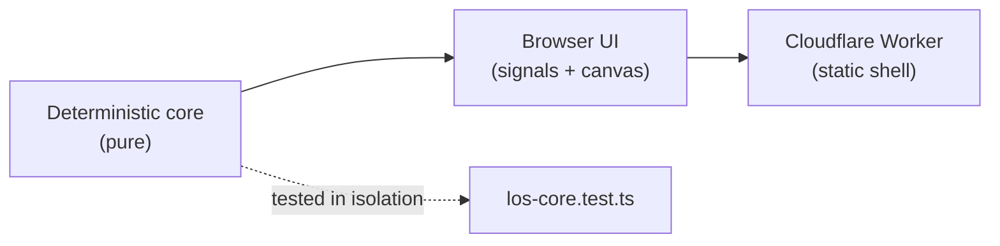

# Patterns

Short notes on the load-bearing patterns in this codebase. Read these before
making non-trivial changes; each one explains the pattern, where it lives, why
it has that shape, and the gotchas that keep it working.

- [layered-separation.md](./layered-separation.md) — Three layers with a strict
  dependency direction: deterministic core, browser UI, Cloudflare Worker. The
  core knows nothing about the DOM or Cloudflare.
- [deterministic-core.md](./deterministic-core.md) — All geometry and image
  analysis is pure and side-effect free, so the same inputs always produce the
  same occluders and visibility. This is what makes the core testable.
- [signals-and-rendering.md](./signals-and-rendering.md) — State is module-level
  signals; one `effect(renderBoard)` subscribes to a `renderTick`; mutations
  call `requestCanvasRender()`. Reactive state drives an imperative canvas draw.
- [snapshot-undo-redo.md](./snapshot-undo-redo.md) — Editing history is a bounded
  stack of whole-state `EditorSnapshot`s, cloned before each mutation.
- [candidate-review-export.md](./candidate-review-export.md) — Detection only
  proposes *candidates*; the human corrects them; the sidecar export is the
  reviewed, durable artifact. Hand-authored occluders are protected by a
  `manual-` id prefix.

## How these relate

The deterministic core is the foundation: because it is pure, the UI can lean on
it for every geometry question, and it can be tested without a browser. The
remaining patterns are all about how the UI manages state on top of that core.
