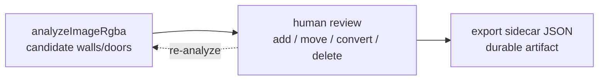

# Candidate → Review → Export

## Pattern

Automatic detection is treated as a **candidate generator only**. The pipeline
never produces an authoritative answer; it proposes walls and doors, the human
reviews and corrects them, and the **sidecar export** is the reviewed, durable
artifact. Hand-authored occluders are first-class and survive re-analysis.

## Where it lives

- Generation: `analyzeImageRgba` in `web/src/los-core.ts`.
- Review tools and re-analysis: `analyzeTiles`, the editing tools, and
  `carveDoorGaps` in `web/src/main.tsx`.
- Export: `exportSidecar` in `web/src/main.tsx`; shape in
  [reference/sidecar-format.md](../reference/sidecar-format.md).

## Why this shape

Raster maps are ambiguous — antialiasing, furniture, and labels all read as dark
pixels — so detection will always be approximate. Rather than chase perfect
extraction, the tool optimises for fast human correction and a clean export.
[`AGENTS.md`](../../AGENTS.md) states this directly: treat automatic wall
extraction as a candidate generator; the user reviews and corrects before
relying on exported sidecars.

## The `manual-` id convention

This is the load-bearing detail that makes re-analysis safe:

- Detected occluders get position-ordered ids: `wall-0001`, `door-0001`, ….
- Hand-drawn occluders get a `manual-` prefix: `manual-wall-<hex>`,
  `manual-door-<hex>`.
- `analyzeTiles` keeps occluders whose id starts with `manual-` and replaces only
  the generated ones, so re-running analysis never discards your corrections.

## Gotchas

- Anything that should survive re-analysis must carry the `manual-` prefix. If
  you add a new way to author occluders, mint its id with that prefix.
- Door open/closed state is overlay state (`doorStates`), not part of detection;
  export reflects each door's *current* toggled state, not the detected default.
- Export is currently one-way — the app does not re-import sidecars. If that
  changes, the `manual-` convention and id stability become an import concern too.
