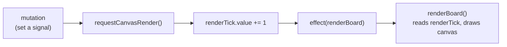

# Signals and Rendering

## Pattern

All UI state lives in **module-level `@preact/signals` signals**, and the canvas
is redrawn by a **single reactive effect** wrapping an imperative draw function.
Mutations never call the renderer directly; they bump a counter signal.

`renderBoard` reads `renderTick.value` at its top so the effect subscribes to it;
any code that changes something visual calls `requestCanvasRender()`.

## Where it lives

- Signals: top of `web/src/main.tsx` (`tool`, `occluders`, `doorStates`,
  `tokens`, `boardSize`, `zoom`, `renderTick`, …).
- `requestCanvasRender()` bumps `renderTick`.
- `effect(renderBoard)` is created once when the `App` mounts and disposed on
  unmount.
- `renderBoard` calls the draw steps in a fixed order: map, grid, door markers,
  fog, range, tokens, debug walls, edit overlay, preview.

## Why this shape

Canvas drawing is inherently imperative, but the app state is reactive. Routing
every change through one `renderTick` signal means:

- there is exactly one place that draws the board, with one well-defined draw
  order (so layering — fog under tokens, overlays on top — is consistent);
- components and event handlers never need a reference to the canvas; they just
  mutate state and call `requestCanvasRender()`;
- the Preact component tree stays small — it renders the drawer/controls, while
  the board is a single `<canvas>` driven by the effect.

## Gotchas

- A new visual feature must call `requestCanvasRender()` after it mutates state,
  or the canvas won't update. (Signal reads inside `renderBoard` are the only
  automatic redraw triggers; everything else funnels through the tick.)
- Keep the draw-order list in `renderBoard` authoritative — add new layers there
  in the right position rather than drawing ad hoc elsewhere.
- `renderBoard` early-returns when there is no map; guard new draw steps the same
  way so an empty board stays cheap.
- Offscreen canvases (`exploredCanvas`, `fogCanvas`) are module-level too; see
  [snapshot-undo-redo.md](./snapshot-undo-redo.md) for what is and isn't part of
  undo.
