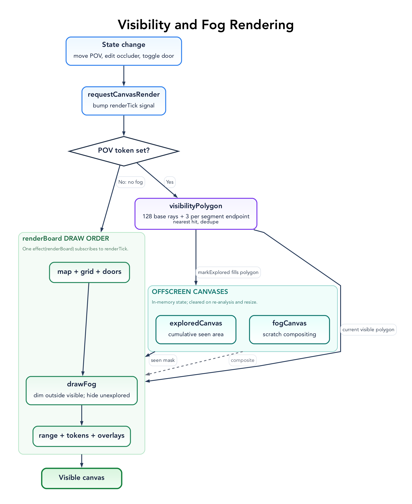

# Browser UI Guide

The interactive app lives in `web/src/main.tsx`: a Preact + `@preact/signals` UI
that renders the board to a 2D `<canvas>` and calls the
[core](los-core.md) for all geometry. State is held in
module-level signals and is **in-memory only** — reload starts fresh, so the
[sidecar export](sidecar-format.md) is the thing to keep.

The two patterns behind this UI are
[signals and rendering](patterns/signals-and-rendering.md) (how state drives
the canvas) and [snapshot undo/redo](patterns/snapshot-undo-redo.md).

## Layout

A full-bleed canvas with a collapsible **control drawer**. The drawer has four
tabs (`activeDrawerTab`): **Tools**, **Counters**, **Maps**, **State**. The
visual language follows the TRE direction in [`AGENTS.md`](../AGENTS.md):
black background, terminal-green accent (`#39ff14`), JetBrains Mono labels.

## Tools

The active tool (`tool` signal) decides how canvas pointer input is interpreted:

| Tool     | Purpose |
|----------|---------|
| `viewer` | Pan/inspect; select and drag the point-of-view, no editing. |
| `wall`   | Draw new wall occluders (stored with a `manual-` id prefix). |
| `door`   | Draw new door occluders. |
| `erase`  | Remove the occluder nearest the pointer. |
| `token`  | Place counter tokens of the active kind/group. |

Newly drawn walls and doors get `manual-` ids so re-running **Analyze** preserves
them while replacing the auto-generated ones.

## Maps tab

- **Load** local map images via the picker or by dragging files onto the window
  (drag state is tracked so the drop zone can highlight).
- **Columns** (`columnsValue`, default 2) controls how `arrangeTiles` lays tiles
  into a grid; the board is sized to fit.
- **Grid** (`gridValue`, default 50) is the pixel grid scale passed to analysis
  and used for snapping and door carving.
- **Analyze** rasterises each placement and runs the core detector, mapping
  results back into board space and carving door gaps out of overlapping walls.

## Counters tab

Twelve counter **kinds** (officer, marine, scout, engineer, medic, scientist,
trader, security, reptilian, amphibian, insectoid, psion), each with a WebP
portrait served from `web/public/token-portraits/`. Counters are grouped **A–H**;
within a group, members are auto-labelled (e.g. `A1`, `A2`, …). Pick the active
kind and group, then place tokens with the `token` tool.

Any token can be elected the **point of view** (`povTokenId`). The POV token's
`visibilityPolygon` drives the live fog and the optional sight-range ring.

## State tab

- **Sight** (`sightValue`, default 700) is the POV visibility radius in board
  pixels.
- **Show walls** (`showWalls`) overlays detected/edited occluders for review.
- **Hide unseen** (`hideUnseen`) toggles fog over never-explored areas.
- **Doors** can be toggled open/closed (`doorStates`); open doors stop blocking
  sight immediately.
- **Export** writes the sidecar JSON (see below).
- **Undo / Redo** walk the editor history.

## Fog and "explored" tracking

Two offscreen canvases back the fog:

- `exploredCanvas` accumulates every area the POV has ever seen. `markExplored`
  fills the current visibility polygon onto it, so previously-seen regions stay
  revealed even after the POV moves.
- `fogCanvas` is scratch space for compositing the current frame: areas outside
  the current visible polygon are dimmed, and never-explored areas (with
  **Hide unseen** on) are fully obscured.

## Editing occluders and tokens

- In `wall`/`door` tools, drag to draw; existing occluders can be grabbed by an
  endpoint (`start`/`end`) or body (`EditDrag`) and moved. A selected occluder
  can be converted between wall and door (`convertSelectedOccluder`).
- Points snap to the sub-grid while editing (`snapPoint`).
- A selected occluder or token can be deleted with the keyboard (below).
- Door gaps are re-carved (`carveDoorGaps`) so a closed door blocks the run it
  sits in and an open door clears it.

## Keyboard shortcuts

Active when focus is on the board (not an input field — `targetAcceptsMapShortcuts`):

| Keys | Action |
|------|--------|
| `Cmd/Ctrl + Z` | Undo |
| `Cmd/Ctrl + Shift + Z` or `Cmd/Ctrl + Y` | Redo |
| `Escape` | Clear selection/hover and cancel in-progress drags |
| `Delete` / `Backspace` | Remove the selected token, otherwise the selected occluder |

## Zoom and pan

Mouse-wheel zoom (`handleWheel`) is clamped to `[0.35, 4]` and centres on the
pointer. Stroke widths are divided by zoom (`screenPixels`) so overlays stay a
constant on-screen size.

## Export

The **Export** action (`exportSidecar`) builds the sidecar object and tries to
copy it to the clipboard; if the clipboard is unavailable it falls back to a
`line-of-sight-sidecar.json` download. See
[sidecar-format.md](sidecar-format.md) for the exact shape.
